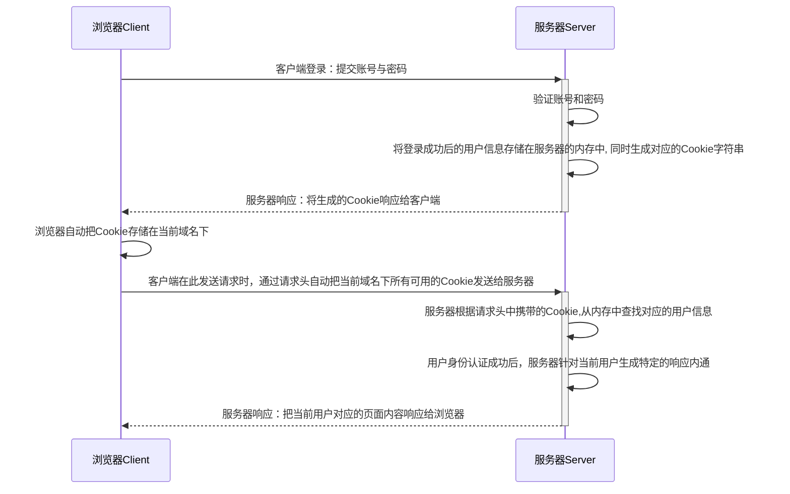
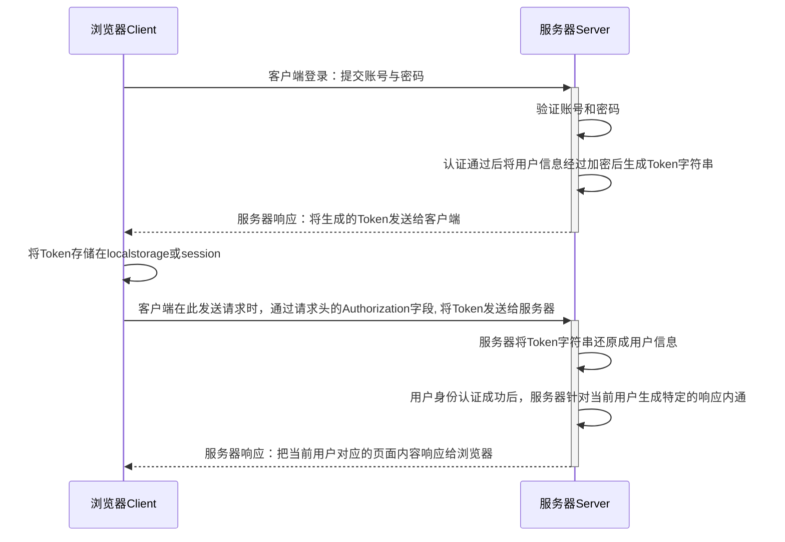

## 1. 托管静态资源

express 提供了一个非常好用的函数，叫做`express.static`， 通过它，我们可以非常方便的创建一个静态资源服务器，例如，通过下面的代码可以将public目录下的图片、CSS文件、Javascript文件对外开放访问

```javascript
app.use(express.static(path.join(__dirname, 'public')));
```

现在可以访问public目录中的所有文件：

- http://localhost:3000/images/bg.jpg
- http://localhost:3000/css/styles.css

:fire: 如果要托管多个静态资源目录，请多次调用`express.static`方法

```javascript
app.use(express.static(path.join(__dirname, 'public')));
app.use(express.static(path.join(__dirname, 'files')));
```

访问静态资源文件时，express.static方法会根据目录的添加顺序查找所需文件。

:fire: 如果希望在托管的静态资源访问路径之前，挂载路径前缀，则可以使用如下方式：

```javascript
app.use('/public', express.static(path.join(__dirname, 'public')));
```

现在，你就可以通过带有/public前缀地址来访问public目录下的文件了：

- http://localhost:3000/public/images/bg.jpg
- http://localhost:3000/public/css/styles.css

## 2.路由

在Express中，路由指的是客户端的请求与服务器函数之间的映射关系。Express路由分别是请求的类型，请求的URL地址，处理函数。例如：`app.get("/url1", function)`

为了方便对路由进行模块化管理，Express推荐将路由抽离为单独的模块，具体步骤如下：

:one:  创建路由模块对应的JS文件

:two:  调用`express.Router` 函数创建路由对象

:three:  想路由对象上挂载具体路由

:four:  使用`module.exports` 向外共享路由对象

:five:  使用 `app.use` 函数注册路由模块

1. 创建路由模块

```javascript
const express = require('express');
const router = express.Router();

router.get("/user/list", function (req, res) {
  res.send("Get user list.");
});

router.post("/user/add", function (req, res) {
  res.sed("Add a new user");
})

module.exports = router;
```

2. 注册路由模块

```javascript
const userRouter = require('./router/user.js');

app.use(userRouter);
```


:warning:	==类似于托管静态资源时，为静态资源统一挂载访问前缀一样，路由模块也可以添加前缀==

```javascript
const userRouter = require("./router/user.js");

app.use('/api', userRouter);
```


## 3.中间件

### 1.简单应用

当一个请求到达Express的服务器之后，可以连续调用多个中间件，从而对这次请求进行预处理。 Express中间件本质上就是一个处理函数，格式如下：


```javascript
app.get("/", function (req, res, next) {
  next();
})
```

注意：中间件形参列表中，必须包含一个next函数，而路由处理函数中只包含req, res。

1. 定义中间件函数

```javascript
const mw = function (req, res, next) {
  console.log("这是一个中间件处理函数")；
  
  next();
}
```

2. 注册到全局中间件

客户端发起的任何请求，到达服务器之后，都会触发的中间件。通过`app.use`	 注册一个中间件。

```javascript
const mw1 = fucntion (req, res, next) {
  next();
}

app.use(mw1);
```

3. 注册局部中间件

不使用`app.use`创建的中间件就是局部中间件。

```javascript
const mw1 = fucntion (req, res, next) {
  next();
}

app.get('/', mw1, function(req, res) {
  
})

// 对于多个局部中间件可以使用下面用法
app.get('/', mw1, mw2, (req, res) => res.send("MW1"));
app.get('/', [mw1, mw2] (req, res) => res.send("MW1"));
```

### 2.中间件分类

1. 应用级别中间件

通过`app.use()` 、`app.get()` 或`app.post()` 绑定到app实例上的中间件，叫做应用级别中间件。

```javascript
const mw1 = (req, res, next) => {
  next();
}

app.use(mw1);
app.get('/', mw1, (req, res) => {
  res.send('Home Page');
})
```

2. 路由级别中间件

绑定到`express.Router()` 实例上的中间件，叫做路由级别中间件。它的用法和应用级别中间件没有任何区别。只不过应用级别中间件是绑定在app实例上，而路由级别中间件绑定到router实例上。

```javascript
const express = express();
const router = express.Router();

router.use(function (req, res, next) {
  console.log('Time: ', Date.now());
  next();
})

app.use('/', router);
```

3. 错误级别中间件

错误级别中间件的作用：专门用来捕获整个项目中发生的异常错误，从而防止项目异常崩溃的问题。格式：错误级别中间件的处理函数必须有4个形参，前后顺序分别为：`(err, req, res, next)`

```javascript
app.get('/', function (req, res) {
  throw new Error("服务器内部发生错误！");
  res.send("Home Page");
});

app.use(function (err, req, res, next) {
  console.log("发生了错误： ", err.message);
  res.send("Error! " + err.message);
});
```

4. Express 内置中间件

Express内置了3个常用的中间件，极大地提高了Express项目的开发效率和体验：

:one:   `express.static` 快速托管静态资源的内置中间件，例如：HTML文件、图片、CSS样式等。

:two:   `express.json` 解析JSON格式的请求数据

:three:   `express.urlencoded` 解析URL-encoded 格式的请求体数据

```javascript
// 解析 application/json 格式数据
app.use(express.json());
// 解析 application/x-www-form-urlencoded 格式数据
app.use(express.urlencoded({extended: false}));
```

### 3.自定义中间件

自己动手模拟一个类似于`express.urlencoded` 的中间件，用于解析POST提交到服务器的表单数据

```javascript
const qs = require('querystring'); // 用来处理查询字符串

app.use((req, res, next) => {
  let str = '';
  // 当请求有数据获取就会触发这个事件
  req.on('data', (chunk) => {
    str += chunk;
  });
  // 当请求完毕，就会触发这个end 事件
  req.on('end', () => {
    const body = qs.parse(str);
    req.body = body;
    next();
  })
})
```

## 4. CORS跨域

CORS 是Express的一个第三方中间件。通过安装和配置cors中间件，可以很方便地解决跨域问题。

```javascript
const cors = require('cors');

app.use(cors());
```


## 5.身份认证

对于服务端渲染和前后端分离这两种开发模式，分别有着不同的身份认证方案：

1. 服务端渲染推荐使用Session认证机制
2. 前后端分离推荐使用JWT认证机制

### 1. Session认证机制

HTTP协议是无状态的，指的是客服端的每次HTTP请求都是独立的，连续多个请求之间没有直接的关系，服务器不会主动保留没你HTTP请求状态。

Cookie是存储在用户浏览器中的一段不超过4KB的字符串。它由一个名称(Name)、一个值(Value) 和其他几个用于控制Cookie有效期、安全性、使用范围的可选属性组成。

不同域名下的Cookie是各自独立的，每当客户端发起请求时会自动把当前域名下所有未过期的Cookie一同发送到服务器。

Cookie的几大特性：1. 自动发送， 2. 域名独立， 3. 过期时限， 4. 4KB限制

客户端在第一次请求服务器时，服务器通过响应头的形式向客户端发送一个身份认证的Cookie，客户端会自动将Cookie保存在浏览器中。随后，当客户端浏览器每次请求服务器的时候，浏览器会自动将身份认证相关的Cookie，通过请求头的形式发送给服务器，服务器即可验明客户端的身份。

由于Cookie是存储在浏览器中的，而且浏览器也提供了读写Cookie的API，因此Cookie可以很容易被伪造，不具有安全性。因此不建议服务器将重要的隐私数据通过Cookie的形式发送给浏览器。



实例：

使用`express-session` 中间件可以完成session认证。

1. ==配置session==：当`express-session`中间件配置成功后，即可通过`req.session`来访问和使用session对象，从而存储用户的关键信息.

2. ==保存或获取session数据==：可以直接从`req.session`对象上获取之间存储的数据

3. ==清空session==：调用`req.session.destry()` 即可清空服务器中的session信息

```javascript
const session = require('express-session');

app.use({
  secret: 'keyboard cat', // 任意字符串
  resave: false,
  saveUninitialized: false,
});

app.post('/api/login', (req, res) => {
  if (req.body.username !== 'admin' || req.body.password !== '000000') {
    return res.send({status: 1, msg: '登录失败'});
  }
  
  req.session.user = req.body; // 将用户信息保存到session中
  req.session.islogin = true;
  res.send({status: 0, msg: '登录成功'});
});

app.get('/api/username', (req, res) => {
  if (!req.session.islogin) {
    return res.send({status: 1, msg: 'failed'});
  }
  res.send({status: 0, msg: 'success', username: req.session.user.username});
});

app.post('/api/logout', (req, res) => {
  req.session.destry();
  res.send({status: 0, msg: '退出登录成功'});
})
```

### 2. JWT认证机制

Session认证机制需要配置Cookie才能实现。由于Cookie默认不支持跨域访问，所以当涉及到前端跨域请求后端接口的时候，需要做很多额外配置才能实现跨域Session认证。

注意：

- 当前端请求后端接口不存在跨域问题的时候，推荐使用session认证机制
- 当前端需要跨域请求后端接口的时候，不推荐使用session认证机制，而使用JWT认证机制

JWT（JSON Web Token）是目前最流行的跨域认证解决方案。



JWT通常由三部分组成：Header（头部）、Payload（有效载荷）、Signature（签名）。三者之间用`.`分割

- Payload部分才是真正的用户信息，它是用户信息经过加密之后生成的字符串。
- Header和Signature是安全性相关的部分，只是为了保证Token的安全性。

如何使用：

1. 安装相关依赖 `jsonwebtoken` （生成JWT字符串）、`express-jwt` （将JWT字符串解析并还原为JSON对象）

2. 定义密钥：为了保证JWT的安全性，需要专门定义一个加密和解密的密钥

3. 登录成功生成JWT

4. 将JWT字符串还原为JSON对象

   客户端每次在访问接口的时候都需要在请求头中添加Authorization字段，将Token字符串发送到服务器进行身份认证。此时，服务器可以通过`express-jwt` 中间件自动将客户端发送过来的Token解析还原为JSON对象。

   `app.use(expressJwt({secret: secretKey}).unless({path: [/^\/api\//]}))`

5. 获取用户信息

   当`express-jwt`中间件配置成功后，即可使用`req.usser`对象访问JWT字符串中的用户信息

6. 解析JWT失败后产生的错误

   当使用`express-jwt`	解析token失败后，可以通过Express的错误中间件捕获该错误并进行相关处理。

   `err.name === 'UnauthorizedError'`

```javascript
const jwtToken = require('jsonwebtoken');
const expressJwt = require('express-jwt');

const secretKey = 'this is secret key';

// .unless({path: [/^\/api\//]}) 用来指定哪些接口不需要访问权限
app.use(expressJwt({secret: secretKey}).unless({path: [/^\/api\//]}))

app.use((err, req, res, next) => {
  if (err.name === 'UnauthorizedError') {
    return res.send({status: 401, message: '无效Token'});
  }
  res.send({status: 500, message: '未知错误'});
})

app.post('/api/login', (req, res) => {
  res.send({
    status: 200, 
    message: '登录成功', 
    token: jwtToken.sign({username: userInfo.username}, secretKey, {expiresIn: '30s'}),
  });
});
```

  　