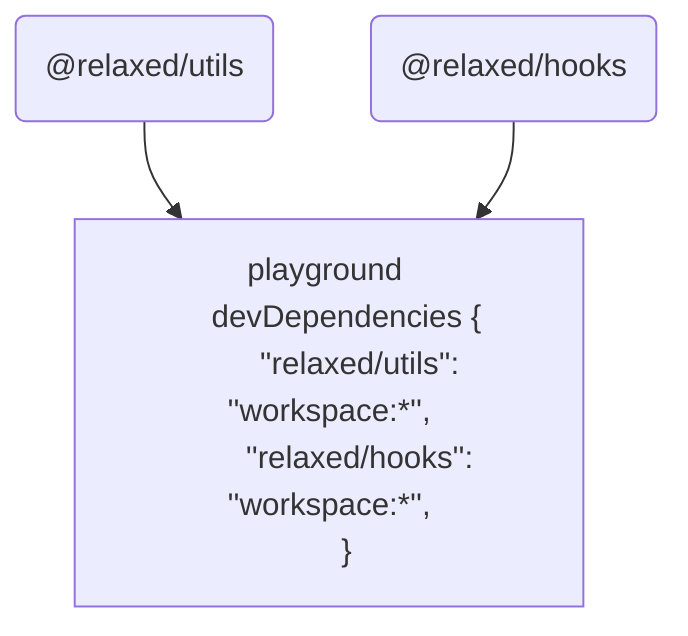

# 1. Turborepo简介

[Turborepo](https://turbo.build/repo/docs) 是一款Javascript 和Typescript打包构建系统。在进一步了解Turborepo之前有必要先了解一下monorepo 和 polyrepo。

## 1. 什么是monorepo

Monorepo 是一个单一的存储库，在这个存储库中包含多个项目，且这些项目之间具有明确的相互关系。

对于一个Monorepo会包含多个项目，但是仅仅将很多的项目放到一个repo里面不能称之为monorepo, 更重要的是我们要确定这些项目是有明确关系的，同时也应该反对将大量无关的项目放到一个repo里面进行管理。

与monorepo相反的项目管理方式是polyrepo，这也是在monorepo出现以前比较标准的应用开发方式。每一个团队、应用或项目管理一个repo， 每一个repo都有独立的项目结构和构建流程。

对于polyrepo最显著的特点是不同项目之间相互独立，这样可以决定应用该怎样组织，采用什么方式发布。同时这种方式也有很大的不足：应用之间过于隔离，使得相互之间在合作的过程中会发生难以解决的麻烦。

<span style="font-size:1.125rem;font-weight:bolder">Polyrepo的不足：</span>

1. <span style="color:#8e44ad;font-weight:bolder">代码分享很繁琐</span>。 为了分享代码需要经过创建分支，创建发布环境，提交代码，发布模块，解决版本兼容性等一些工作
2. <span style="color:#8e44ad;font-weight:bolder">大量代码重复</span>。通常团队之间为了减少沟通和版本发布带来的麻烦，往往会添加很多冗余代码，或则代码结构不是很合理。这样就带来巨大的维护和安全成本。
3. <span style="color:#8e44ad;font-weight:bolder">共享库之间巨大的变更成本</span>。考虑到这样一个场景：在一个共享库中发生一个严重的bug，而这个修改又需要同步到不同的repo中，这个过程又有可能会发生其他的bug。这样又要重新经过这个痛苦的过程。
4. <span style="color:#8e44ad;font-weight:bolder">项目构建工具不一致</span>。每一个项目都有独立的命令用于运行测试，代码格式化，部署等。 这样对于理解这个命令的意义也会带来一定的心理负担。

面对polyrepo的不足，monorepo由于使用的是单一存储库，就可以很容易的避免了这些问题。

一个优秀的Monorepo 应当具有一下几个方面的能力：

1. <span style="color:#8e44ad;font-weight:bolder">依赖管理能力</span>。 随着依赖数量以及项目数量的增加，依旧能够依赖结构的正确性，使得整个项目能够完美运行起来，不致于报任何警告。
2. <span style="color:#8e44ad;font-weight:bolder">任务编排能力</span>。 能够以最大效率和合适的顺序执行monorepo中项目的任务，并缺复杂度不会随着项目的增多的增加。
3. <span style="color:#8e44ad;font-weight:bolder">版本发布能力</span>。能够基于改动的项目，结合项目依赖关系，正确地进行版本号变更、CHANGELOG生成以及项目发布
4. <span style="color:#8e44ad;font-weight:bolder">迅速地构建以及安装速度</span>。 随着项目的增加，整个repo构建速度不应该有太大的影响


目前可以构建monorepo的工具有很多，例如：

| 工具                                        | 简述                                                 |
| ------------------------------------------- | ---------------------------------------------------- |
| [BIt  :link:]()https://bit.dev              | 用于组件驱动开发的工具链                             |
| [Rush :link:]()https://rushjs.io            | 一个可扩展的 web 单仓库管理器。                      |
| [Nx :link:]()https://nx.dev                 | 具有一流的 monorepo 支持和强大集成的下一代构建系统   |
| [Turborepo :link: ](https://turborepo.org/) | 用于 JavaScript 和 TypeScript 代码库的高性能构建系统 |
| [Lerna :link:](https://www.lernajs.cn/)     | 用于管理包含多个软件包的项目                         |

其他更多工具，以及这些工具之间的对于细节，可以参考：https://monorepo.tools/


## 2. 什么是Turborepo

Turborepo 是一个用于 JavaScript 和 TypeScript 代码库的高性能构建系统。通过增量构建、智能远程缓存和优化的任务调度，Turborepo 可以将构建速度提高 85% 或更多，使各种规模的团队都能够维护一个快速有效的构建系统，该系统可以随着代码库和团队的成长而扩展。

**Turborepo的优势：**

1. **多任务并行处理。**Turbo支持多个任务的并行运行，我们在对多个子包，编译打包的过程中，turbo会同时进行多个任务的处理
2. **更快的增量构建。** 如果我们的项目过大，构建多个子包会造成时间和性能的浪费，turborepo中的缓存机制 可以帮助我们记住构建内容 并且跳过已经计算过的内容，优化打包效率。
3. **云缓存。**Turbo通过其远程缓存功能可以帮助多人远程构建云缓存实现了更快的构建。
4. **任务管道。**用配置文件定义任务之间的关系，然后让Turborepo优化构建内容和时间。
5. **基于约定的配置。** 通过约定降低复杂性，只需几行JSON 即可配置整个项目依赖，执行脚本的顺序结构。
6. **浏览器中的配置文件。** 生成构建配置文件并将其导入Chrome或Edge以了解哪些任务花费的时间最长。


# 2. Turborepo核心概念

## 1. 管道（pipeline）

管道（pipeline）代表当前项目不同任务之间的依赖关系图。在Turborepo中，任务可以理解为各个子项目里`package.json`中的script 命令。

Turborepo只能知道当前项目有多少个子项目，但是无法理解不同任务之间的关系。所以需要用户自己声明这些任务之间的关系，然后Turbo就可以以合适的方式调度、执行和缓存这些任务。

这个管道需要定义在根目录下的`turbo.json`文件中。

在`pipeline`中，每个key都是一个可以有`turbo run`执行的任务名称。如果`turbo`发现这个任务名称与某个子项目中script脚本名称向匹配，则会执行这个脚本。这样就可以通过`pipeline`管理了所有子项目。

<u>*在我们执行`turbo run ***`命令的时候 turbo 会根据我们定义的 [Pipelines](https://link.juejin.cn/?target=https%3A%2F%2Fturborepo.org%2Fdocs%2Fcore-concepts%2Fpipelines) 里对命令的各种配置去对我们的每个**package**中的`package.json 中 对应的script`执行脚本进行有序的执行和缓存输出的文件。*</u>

```json
{
  "$schema": "https://turbo.build/schema.json",
  "pipeline": {
    "build": {
      "dependsOn": ["^build"]
    },
    "test": {
      "outputs": ["coverage/**"],
      "dependsOn": ["build"],
      "inputs": ["src/**/*.tsx", "src/**/*.ts", "test/**/*.ts"],
      "outputMode": "full"
    },
    "dev": {
      "cache": false,
      "persistent": true
    }
  }
}
```


## 2. 依赖（DependsOn）

有如下示例，有三个文件库，分别为 `playground, @relaxed/utils, @relaxed/hooks`，其中，playground 依赖于 @relaxed/utils 和 @relaxed/hooks。 



```json
"pipeline": {
  "build": {
    "dependsOn": ["^build"]
  }
}
```

https://juejin.cn/post/7129267782515949575#heading-13

<span style="color:purple;font-size:1.15rem;font-weight:bold">I. 常规依赖</span>

​	在`dependsOn`中的依赖不是以`^`开头，表示任务之间的依赖关系是项目（workspace）级别的。例如：项目的`test`和`lint`命令依赖于`build`命令先完成。

```json
{
  "pipeline": {
    "test": {
      // "A workspace's `test` command depends on its own `lint` and
      // `build` commands first being completed"
      "dependsOn": ["lint", "build"]
    },
  }
}
```

<span style="color:purple;font-size:1.15rem;font-weight:bold">2. 拓扑依赖</span>

​	可以通过`^`符号来显式声明该任务具有拓扑依赖性，需要依赖的包执行完相应的任务后才能开始执行自己的任务。例如：项目的`build`任务仅在`dependencies`和`devDependencies`中所有的包的自身`build`任务执行完毕后才执行当前项目的`build`任务

```json
{
  "pipeline": {
    "build": {
      // "A workspace's `build` command depends on its dependencies'
      // or devDependencies' `build` command being completed first"
      "outputs": [".next/**", "!.next/cache/**", "dist/**"],
      "dependsOn": ["^build"]
    },
  }
}
```

<span style="color:purple;font-size:1.15rem;font-weight:bold">3. 空依赖</span> 

如果一个任务的dependsOn为`[]` 或者不声明这个属性，那么表明这个任务可以在任意时间被执行


## 3. 输入（Input）

默认值为`[]`。在`input`中指定将要匹配的文件集，即告诉`turbo`仅当匹配的文件发生改变时才会重新运行相关的命令，否则就会默认文件没有发生改变从而使用缓存的结果输出给用户。

指定`[]`意味着任务在任何文件发生更改时重新运行。

```json
{
  "$schema": "https://turborepo.org/schema.json",
  "pipeline": {
   "test": {
      // A package's `test` task should only be rerun when
      // either a `.tsx` or `.ts` file has changed.
      "inputs": ["src/**/*.tsx", "src/**/*.ts", "test/**/*.ts"]
    }
  }
}
```


## 4. 输出（Output）

`outputs` 表示命令执行输出的文件缓存目录

我们还可以通过传递一个空数组用来告诉`turbo`任务是一个副作用，这样我们不会输出任何文件

```json
"pipeline": {
  "build": {
    // "Cache all files emitted to package's dist/** or .next
    // directories by a `build` task"
    "outputs": ["dist/**", ".next/**"],
    "dependsOn": ["^build"]
  },
 }
```

## 5. 缓存（Cache）

默认值为`true`。表示是否缓存任务的输出结果 `outputs`。比如在开发阶段会结合`watch`模式，这样`turbo`就不会缓存结果。

```json
{
  "pipeline": {
    "dev": {
      "cache": false,
    }
  }
}
```


## 6. 输出模式（OutputMode）

设置输出日志记录的类型。

| 类型            | 说明                 |
| --------------- | -------------------- |
| `full` （默认） | 显示所有的输出       |
| `hash-only`     | 只显示任务的散列     |
| `new-only`      | 只显示缓存缺失的输出 |
| `errors-only`   | 只显示任务失败的输出 |
| `none`          | 隐藏所有任务输出     |

```json
{
  "pipeline": {
    "build": {
      "dependsOn": ["^build"],
      "outputs": [".svelte-kit/**", "dist/**"],
      "outputMode": "new-only"
    },
  }
}
```


## 7. 持久化（Persistent）

如果任务是长期运行的过程，例如开发服务器或`--watch`模式，则将其标记为`persistent`。Turbo将防止其他任务依赖于持续性任务。如果不设置此配置，如果任何其他任务依赖于`dev`，它将永远不会运行，因为`dev`永远不会退出。使用此选项，`turbo`可以警告您配置无效。

```json
{
  "pipeline": {
    "dev": {
      "persistent": true
    }
  }
}
```
