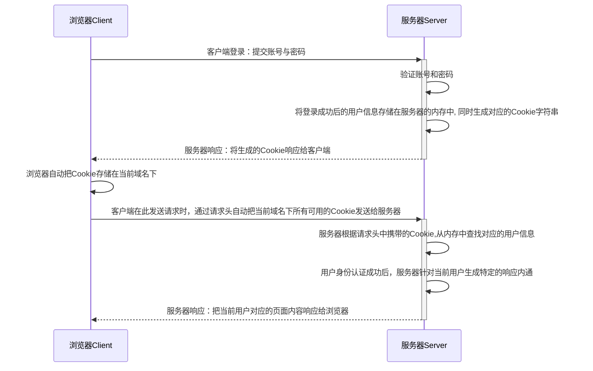
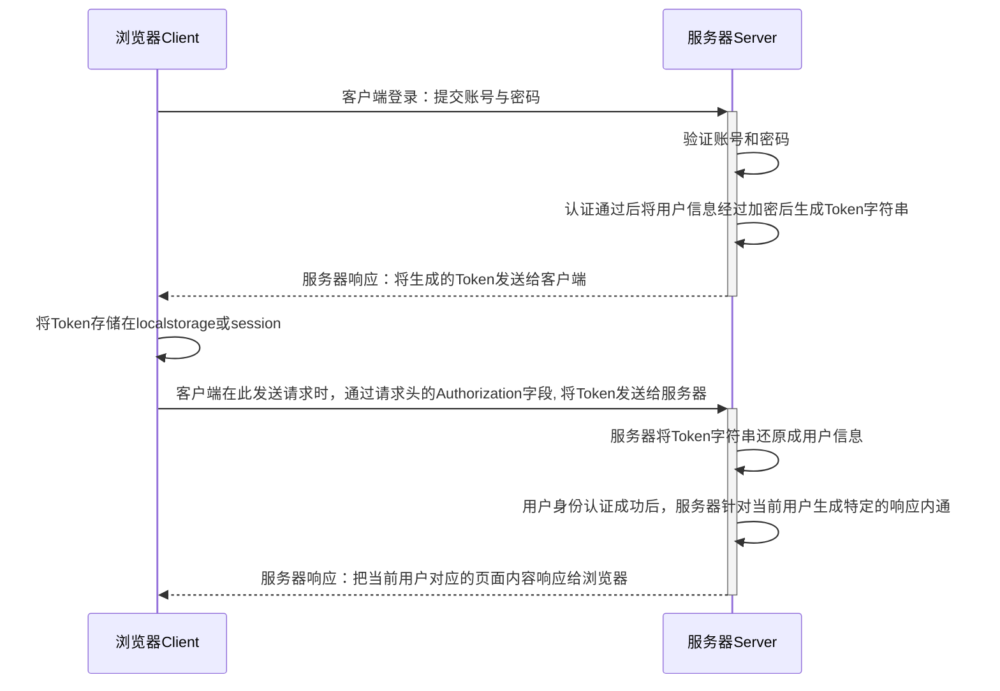

# Express

## 1. 托管静态资源

express 提供了一个非常好用的函数，叫做`express.static`， 通过它，我们可以非常方便的创建一个静态资源服务器，例如，通过下面的代码可以将public目录下的图片、CSS文件、Javascript文件对外开放访问

```javascript
app.use(express.static(path.join(__dirname, 'public')));
```

现在可以访问public目录中的所有文件：

- http://localhost:3000/images/bg.jpg
- http://localhost:3000/css/styles.css

:fire: 如果要托管多个静态资源目录，请多次调用`express.static`方法

```javascript
app.use(express.static(path.join(__dirname, 'public')));
app.use(express.static(path.join(__dirname, 'files')));
```

访问静态资源文件时，express.static方法会根据目录的添加顺序查找所需文件。

:fire: 如果希望在托管的静态资源访问路径之前，挂载路径前缀，则可以使用如下方式：

```javascript
app.use('/public', express.static(path.join(__dirname, 'public')));
```

现在，你就可以通过带有/public前缀地址来访问public目录下的文件了：

- http://localhost:3000/public/images/bg.jpg
- http://localhost:3000/public/css/styles.css

## 2.路由

在Express中，路由指的是客户端的请求与服务器函数之间的映射关系。Express路由分别是请求的类型，请求的URL地址，处理函数。例如：`app.get("/url1", function)`

为了方便对路由进行模块化管理，Express推荐将路由抽离为单独的模块，具体步骤如下：

:one:  创建路由模块对应的JS文件

:two:  调用`express.Router` 函数创建路由对象

:three:  想路由对象上挂载具体路由

:four:  使用`module.exports` 向外共享路由对象

:five:  使用 `app.use` 函数注册路由模块

1. 创建路由模块

```javascript
const express = require('express');
const router = express.Router();

router.get("/user/list", function (req, res) {
  res.send("Get user list.");
});

router.post("/user/add", function (req, res) {
  res.sed("Add a new user");
})

module.exports = router;
```

2. 注册路由模块

```javascript
const userRouter = require('./router/user.js');

app.use(userRouter);
```


:warning:	==类似于托管静态资源时，为静态资源统一挂载访问前缀一样，路由模块也可以添加前缀==

```javascript
const userRouter = require("./router/user.js");

app.use('/api', userRouter);
```


## 3.中间件

### 1.简单应用

当一个请求到达Express的服务器之后，可以连续调用多个中间件，从而对这次请求进行预处理。 Express中间件本质上就是一个处理函数，格式如下：


```javascript
app.get("/", function (req, res, next) {
  next();
})
```

注意：中间件形参列表中，必须包含一个next函数，而路由处理函数中只包含req, res。

1. 定义中间件函数

```javascript
const mw = function (req, res, next) {
  console.log("这是一个中间件处理函数")；
  
  next();
}
```

2. 注册到全局中间件

客户端发起的任何请求，到达服务器之后，都会触发的中间件。通过`app.use`	 注册一个中间件。

```javascript
const mw1 = fucntion (req, res, next) {
  next();
}

app.use(mw1);
```

3. 注册局部中间件

不使用`app.use`创建的中间件就是局部中间件。

```javascript
const mw1 = fucntion (req, res, next) {
  next();
}

app.get('/', mw1, function(req, res) {
  
})

// 对于多个局部中间件可以使用下面用法
app.get('/', mw1, mw2, (req, res) => res.send("MW1"));
app.get('/', [mw1, mw2] (req, res) => res.send("MW1"));
```

### 2.中间件分类

1. 应用级别中间件

通过`app.use()` 、`app.get()` 或`app.post()` 绑定到app实例上的中间件，叫做应用级别中间件。

```javascript
const mw1 = (req, res, next) => {
  next();
}

app.use(mw1);
app.get('/', mw1, (req, res) => {
  res.send('Home Page');
})
```

2. 路由级别中间件

绑定到`express.Router()` 实例上的中间件，叫做路由级别中间件。它的用法和应用级别中间件没有任何区别。只不过应用级别中间件是绑定在app实例上，而路由级别中间件绑定到router实例上。

```javascript
const express = express();
const router = express.Router();

router.use(function (req, res, next) {
  console.log('Time: ', Date.now());
  next();
})

app.use('/', router);
```

3. 错误级别中间件

错误级别中间件的作用：专门用来捕获整个项目中发生的异常错误，从而防止项目异常崩溃的问题。格式：错误级别中间件的处理函数必须有4个形参，前后顺序分别为：`(err, req, res, next)`

```javascript
app.get('/', function (req, res) {
  throw new Error("服务器内部发生错误！");
  res.send("Home Page");
});

app.use(function (err, req, res, next) {
  console.log("发生了错误： ", err.message);
  res.send("Error! " + err.message);
});
```

4. Express 内置中间件

Express内置了3个常用的中间件，极大地提高了Express项目的开发效率和体验：

:one:   `express.static` 快速托管静态资源的内置中间件，例如：HTML文件、图片、CSS样式等。

:two:   `express.json` 解析JSON格式的请求数据

:three:   `express.urlencoded` 解析URL-encoded 格式的请求体数据

```javascript
// 解析 application/json 格式数据
app.use(express.json());
// 解析 application/x-www-form-urlencoded 格式数据
app.use(express.urlencoded({extended: false}));
```

### 3.自定义中间件

自己动手模拟一个类似于`express.urlencoded` 的中间件，用于解析POST提交到服务器的表单数据

```javascript
const qs = require('querystring'); // 用来处理查询字符串

app.use((req, res, next) => {
  let str = '';
  // 当请求有数据获取就会触发这个事件
  req.on('data', (chunk) => {
    str += chunk;
  });
  // 当请求完毕，就会触发这个end 事件
  req.on('end', () => {
    const body = qs.parse(str);
    req.body = body;
    next();
  })
})
```

## 4. CORS跨域

CORS 是Express的一个第三方中间件。通过安装和配置cors中间件，可以很方便地解决跨域问题。

```javascript
const cors = require('cors');

app.use(cors());
```


## 5.身份认证

对于服务端渲染和前后端分离这两种开发模式，分别有着不同的身份认证方案：

1. 服务端渲染推荐使用Session认证机制
2. 前后端分离推荐使用JWT认证机制

### 1. Session认证机制

HTTP协议是无状态的，指的是客服端的每次HTTP请求都是独立的，连续多个请求之间没有直接的关系，服务器不会主动保留没你HTTP请求状态。

Cookie是存储在用户浏览器中的一段不超过4KB的字符串。它由一个名称(Name)、一个值(Value) 和其他几个用于控制Cookie有效期、安全性、使用范围的可选属性组成。

不同域名下的Cookie是各自独立的，每当客户端发起请求时会自动把当前域名下所有未过期的Cookie一同发送到服务器。

Cookie的几大特性：1. 自动发送， 2. 域名独立， 3. 过期时限， 4. 4KB限制

客户端在第一次请求服务器时，服务器通过响应头的形式向客户端发送一个身份认证的Cookie，客户端会自动将Cookie保存在浏览器中。随后，当客户端浏览器每次请求服务器的时候，浏览器会自动将身份认证相关的Cookie，通过请求头的形式发送给服务器，服务器即可验明客户端的身份。

由于Cookie是存储在浏览器中的，而且浏览器也提供了读写Cookie的API，因此Cookie可以很容易被伪造，不具有安全性。因此不建议服务器将重要的隐私数据通过Cookie的形式发送给浏览器。



实例：

使用`express-session` 中间件可以完成session认证。

1. ==配置session==：当`express-session`中间件配置成功后，即可通过`req.session`来访问和使用session对象，从而存储用户的关键信息.

2. ==保存或获取session数据==：可以直接从`req.session`对象上获取之间存储的数据

3. ==清空session==：调用`req.session.destry()` 即可清空服务器中的session信息

```javascript
const session = require('express-session');

app.use({
  secret: 'keyboard cat', // 任意字符串
  resave: false,
  saveUninitialized: false,
});

app.post('/api/login', (req, res) => {
  if (req.body.username !== 'admin' || req.body.password !== '000000') {
    return res.send({status: 1, msg: '登录失败'});
  }
  
  req.session.user = req.body; // 将用户信息保存到session中
  req.session.islogin = true;
  res.send({status: 0, msg: '登录成功'});
});

app.get('/api/username', (req, res) => {
  if (!req.session.islogin) {
    return res.send({status: 1, msg: 'failed'});
  }
  res.send({status: 0, msg: 'success', username: req.session.user.username});
});

app.post('/api/logout', (req, res) => {
  req.session.destry();
  res.send({status: 0, msg: '退出登录成功'});
})
```

### 2. JWT认证机制

Session认证机制需要配置Cookie才能实现。由于Cookie默认不支持跨域访问，所以当涉及到前端跨域请求后端接口的时候，需要做很多额外配置才能实现跨域Session认证。

注意：

- 当前端请求后端接口不存在跨域问题的时候，推荐使用session认证机制
- 当前端需要跨域请求后端接口的时候，不推荐使用session认证机制，而使用JWT认证机制

JWT（JSON Web Token）是目前最流行的跨域认证解决方案。



JWT通常由三部分组成：Header（头部）、Payload（有效载荷）、Signature（签名）。三者之间用`.`分割

- Payload部分才是真正的用户信息，它是用户信息经过加密之后生成的字符串。
- Header和Signature是安全性相关的部分，只是为了保证Token的安全性。

如何使用：

1. 安装相关依赖 `jsonwebtoken` （生成JWT字符串）、`express-jwt` （将JWT字符串解析并还原为JSON对象）

2. 定义密钥：为了保证JWT的安全性，需要专门定义一个加密和解密的密钥

3. 登录成功生成JWT

4. 将JWT字符串还原为JSON对象

   客户端每次在访问接口的时候都需要在请求头中添加Authorization字段，将Token字符串发送到服务器进行身份认证。此时，服务器可以通过`express-jwt` 中间件自动将客户端发送过来的Token解析还原为JSON对象。

   `app.use(expressJwt({secret: secretKey}).unless({path: [/^\/api\//]}))`

5. 获取用户信息

   当`express-jwt`中间件配置成功后，即可使用`req.usser`对象访问JWT字符串中的用户信息

6. 解析JWT失败后产生的错误

   当使用`express-jwt`	解析token失败后，可以通过Express的错误中间件捕获该错误并进行相关处理。

   `err.name === 'UnauthorizedError'`

```javascript
const jwtToken = require('jsonwebtoken');
const expressJwt = require('express-jwt');

const secretKey = 'this is secret key';

// .unless({path: [/^\/api\//]}) 用来指定哪些接口不需要访问权限
app.use(expressJwt({secret: secretKey}).unless({path: [/^\/api\//]}))

app.use((err, req, res, next) => {
  if (err.name === 'UnauthorizedError') {
    return res.send({status: 401, message: '无效Token'});
  }
  res.send({status: 500, message: '未知错误'});
})

app.post('/api/login', (req, res) => {
  res.send({
    status: 200, 
    message: '登录成功', 
    token: jwtToken.sign({username: userInfo.username}, secretKey, {expiresIn: '30s'}),
  });
});
```


#  API 项目

> [API 接口文档](https://www.showdoc.cc/escook?page_id=3707158761215217)

## 1. 项目初始化

### 1.1 创建项目

1. 新建 `api_server` 文件夹作为项目根目录，并在项目根目录中运行如下的命令，初始化包管理配置文件：

```bash
npm init -y
```

2. 运行如下的命令，安装特定版本的 `express`：

```bash
npm i express@4.17.1
```

3. 在项目根目录中新建 `app.js` 作为整个项目的入口文件，并初始化如下的代码：

```js
const express = require('express')
// 创建 express 的服务器实例
const app = express()

// write your code here...

// 调用 app.listen 方法，指定端口号并启动web服务器
app.listen(3007, function () {
  console.log('api server running at http://127.0.0.1:3007')
})
```

### 1.2 配置 cors 跨域

1. 运行如下的命令，安装 `cors` 中间件：

```bash
npm i cors@2.8.5
```

2. 在 `app.js` 中导入并配置 `cors` 中间件：

```js
const cors = require('cors')

app.use(cors())
```

### 1.3 配置解析表单数据的中间件

1. 通过如下的代码，配置解析 `application/x-www-form-urlencoded` 格式的表单数据的中间件：

```js
app.use(express.urlencoded({ extended: false }))
```

### 1.4 初始化路由相关的文件夹

1. 在项目根目录中，新建 `router` 文件夹，用来存放所有的`路由`模块

> 路由模块中，只存放客户端的请求与处理函数之间的映射关系

2. 在项目根目录中，新建 `router_handler` 文件夹，用来存放所有的 `路由处理函数模块`

> 路由处理函数模块中，专门负责存放每个路由对应的处理函数

### 1.5 初始化用户路由模块

1. 在 `router` 文件夹中，新建 `user.js` 文件，作为用户的路由模块，并初始化代码：

```js
const express = require('express')
// 创建路由对象
const router = express.Router()

// 注册新用户
router.post('/reguser', (req, res) => {
  res.send('reguser OK')
})

// 登录
router.post('/login', (req, res) => {
  res.send('login OK')
})

module.exports = router
```

2. 在 `app.js` 中，导入注册用户路由模块 ：

```js
const userRouter = require('./router/user')
app.use('/api', userRouter)
```

### 1.6 抽离用户路由模块中的处理函数

> 目的：为了保证 `路由模块` 的纯粹性，所有的 `路由处理函数`，必须抽离到对应的 `路由处理函数模块` 中

1. 在 `/router_handler/user.js` 中，使用 `exports` 对象，分别向外共享如下两个 `路由处理函数` ：

```js
/**
 * 在这里定义和用户相关的路由处理函数，供 /router/user.js 模块进行调用
 */

// 注册用户的处理函数
exports.regUser = (req, res) => {
  res.send('reguser OK')
}

// 登录的处理函数
exports.login = (req, res) => {
  res.send('login OK')
}
```

2. 将 `/router/user.js` 中的代码修改为如下结构：

```js
const express = require('express')
const router = express.Router()

// 导入用户路由处理函数模块
const userHandler = require('../router_handler/user')

// 注册新用户
router.post('/reguser', userHandler.regUser)
// 登录
router.post('/login', userHandler.login)

module.exports = router
```

## 2. 登录注册

### 2.1 新建 ev_users 表

1. 在 `test` 数据库中，新建 `ev_users` 表如下：

```sql
SET NAMES utf8mb4;
SET FOREIGN_KEY_CHECKS = 0;
DROP TABLE IF EXISTS `ev_users`;
CREATE TABLE `ev_users` (
  `id` int(8) NOT NULL AUTO_INCREMENT COMMENT '用户ID',
  `username` varchar(255) NOT NULL COMMENT '用户名',
  `password` varchar(255) NOT NULL COMMENT '密码',
  `nickname` varchar(255) DEFAULT NULL COMMENT '别名',
  `email` varchar(255) DEFAULT NULL COMMENT '邮箱',
  `user_pic` text COMMENT '头像',
  PRIMARY KEY (`id`),
  UNIQUE KEY `id` (`id`),
  UNIQUE KEY `username` (`username`)
) ENGINE=InnoDB AUTO_INCREMENT=2 DEFAULT CHARSET=utf8mb4 COMMENT='用户信息表';

SET FOREIGN_KEY_CHECKS = 1;
```

### 2.2 安装并配置 mysql 模块

> 在 API 接口项目中，需要安装并配置 `mysql` 这个第三方模块，来连接和操作 MySQL 数据库

1. 运行如下命令，安装 `mysql` 模块：

```bash
npm i mysql@2.18.1
```

2. 在项目根目录中新建 `/db/index.js` 文件，在此自定义模块中创建数据库的连接对象：

```js
const mysql = require('mysql')

// 创建数据库连接对象
const db = mysql.createPool({
  host: '127.0.0.1',
  user: 'root',
  password: 'admin123',
  database: 'my_db_01',
})

// 向外共享 db 数据库连接对象
module.exports = db
```

### 2.3 注册

#### 2.3.0 实现步骤

1. 检测表单数据是否合法
2. 检测用户名是否被占用
3. 对密码进行加密处理
4. 插入新用户

#### 2.3.1 检测表单数据是否合法

1. 判断用户名和密码是否为空

```js
// 接收表单数据
const userinfo = req.body
// 判断数据是否合法
if (!userinfo.username || !userinfo.password) {
  return res.send({ status: 1, message: '用户名或密码不能为空！' })
}
```

#### 2.3.2 检测用户名是否被占用

1. 导入数据库操作模块：

```js
const db = require('../db/index')
```

2. 定义 SQL 语句：

```js
const sql = `select * from ev_users where username=?`
```

3. 执行 SQL 语句并根据结果判断用户名是否被占用：

```js
db.query(sql, [userinfo.username], function (err, results) {
  // 执行 SQL 语句失败
  if (err) {
    return res.send({ status: 1, message: err.message })
  }
  // 用户名被占用
  if (results.length > 0) {
    return res.send({ status: 1, message: '用户名被占用，请更换其他用户名！' })
  }
  // TODO: 用户名可用，继续后续流程...
})
```

#### 2.3.3 对密码进行加密处理

> 为了保证密码的安全性，不建议在数据库以 `明文` 的形式保存用户密码，推荐对密码进行 `加密存储`

---

在当前项目中，使用 `bcryptjs` 对用户密码进行加密，优点：

- 加密之后的密码，**无法被逆向破解**
- 同一明文密码多次加密，得到的**加密结果各不相同**，保证了安全性

---

1. 运行如下命令，安装指定版本的 `bcryptjs` ：

```bash
npm i bcryptjs@2.4.3
```

2. 在 `/router_handler/user.js` 中，导入 `bcryptjs` ：

```js
const bcrypt = require('bcryptjs')
```

3. 在注册用户的处理函数中，确认用户名可用之后，调用 `bcrypt.hashSync(明文密码, 随机盐的长度)` 方法，对用户的密码进行加密处理：

```js
// 对用户的密码,进行 bcrype 加密，返回值是加密之后的密码字符串
userinfo.password = bcrypt.hashSync(userinfo.password, 10)
```

#### 2.3.4 插入新用户

1. 定义插入用户的 SQL 语句：

```js
const sql = 'insert into ev_users set ?'
```

2. 调用 `db.query()` 执行 SQL 语句，插入新用户：

```js
db.query(sql, { username: userinfo.username, password: userinfo.password }, function (err, results) {
  // 执行 SQL 语句失败
  if (err) return res.send({ status: 1, message: err.message })
  // SQL 语句执行成功，但影响行数不为 1
  if (results.affectedRows !== 1) {
    return res.send({ status: 1, message: '注册用户失败，请稍后再试！' })
  }
  // 注册成功
  res.send({ status: 0, message: '注册成功！' })
})
```

### 2.4 优化 res.send() 代码

> 在处理函数中，需要多次调用 `res.send()` 向客户端响应 `处理失败` 的结果，为了简化代码，可以手动封装一个 res.cc() 函数

1. 在 `app.js` 中，所有路由之前，声明一个全局中间件，为 res 对象挂载一个 `res.cc()` 函数 ：

```js
// 响应数据的中间件
app.use(function (req, res, next) {
  // status = 0 为成功； status = 1 为失败； 默认将 status 的值设置为 1，方便处理失败的情况
  res.cc = function (err, status = 1) {
    res.send({
      // 状态
      status,
      // 状态描述，判断 err 是 错误对象 还是 字符串
      message: err instanceof Error ? err.message : err,
    })
  }
  next()
})
```

### 2.5 优化表单数据验证

> 表单验证的原则：前端验证为辅，后端验证为主，后端**永远不要相信**前端提交过来的**任何内容**

在实际开发中，前后端都需要对表单的数据进行合法性的验证，而且，**后端做为数据合法性验证的最后一个关口**，在拦截非法数据方面，起到了至关重要的作用。

单纯的使用 `if...else...` 的形式对数据合法性进行验证，效率低下、出错率高、维护性差。因此，推荐使用**第三方数据验证模块**，来降低出错率、提高验证的效率与可维护性，**让后端程序员把更多的精力放在核心业务逻辑的处理上**。

1. 安装 `joi` 包，为表单中携带的每个数据项，定义验证规则：

```bash
npm install joi
```

2. 安装 `@escook/express-joi` 中间件，来实现自动对表单数据进行验证的功能：

```bash
npm i @escook/express-joi
```

3. 新建 `/schema/user.js` 用户信息验证规则模块，并初始化代码如下：

```js
const joi = require('joi')

/**
 * string() 值必须是字符串
 * alphanum() 值只能是包含 a-zA-Z0-9 的字符串
 * min(length) 最小长度
 * max(length) 最大长度
 * required() 值是必填项，不能为 undefined
 * pattern(正则表达式) 值必须符合正则表达式的规则
 */

// 用户名的验证规则
const username = joi.string().alphanum().min(1).max(10).required()
// 密码的验证规则
const password = joi
  .string()
  .pattern(/^[\S]{6,12}$/)
  .required()

// 注册和登录表单的验证规则对象
exports.reg_login_schema = {
  // 表示需要对 req.body 中的数据进行验证
  body: {
    username,
    password,
  },
}
```

4. 修改 `/router/user.js` 中的代码如下：

```js
const express = require('express')
const router = express.Router()

// 导入用户路由处理函数模块
const userHandler = require('../router_handler/user')

// 1. 导入验证表单数据的中间件
const expressJoi = require('@escook/express-joi')
// 2. 导入需要的验证规则对象
const { reg_login_schema } = require('../schema/user')

// 注册新用户
// 3. 在注册新用户的路由中，声明局部中间件，对当前请求中携带的数据进行验证
// 3.1 数据验证通过后，会把这次请求流转给后面的路由处理函数
// 3.2 数据验证失败后，终止后续代码的执行，并抛出一个全局的 Error 错误，进入全局错误级别中间件中进行处理
router.post('/reguser', expressJoi(reg_login_schema), userHandler.regUser)
// 登录
router.post('/login', userHandler.login)

module.exports = router
```

5. 在 `app.js` 的全局错误级别中间件中，捕获验证失败的错误，并把验证失败的结果响应给客户端：

```js
const joi = require('joi')

// 错误中间件
app.use(function (err, req, res, next) {
  // 数据验证失败
  if (err instanceof joi.ValidationError) return res.cc(err)
  // 未知错误
  res.cc(err)
})
```

### 2.6 登录

#### 2.6.0 实现步骤

1. 检测表单数据是否合法
2. 根据用户名查询用户的数据
3. 判断用户输入的密码是否正确
4. 生成 JWT 的 Token 字符串

#### 2.6.1 检测登录表单的数据是否合法

1. 将 `/router/user.js` 中 `登录` 的路由代码修改如下：

```js
// 登录的路由
router.post('/login', expressJoi(reg_login_schema), userHandler.login)
```

#### 2.6.2 根据用户名查询用户的数据

1. 接收表单数据：

```js
const userinfo = req.body
```

2. 定义 SQL 语句：

```js
const sql = `select * from ev_users where username=?`
```

3. 执行 SQL 语句，查询用户的数据：

```js
db.query(sql, userinfo.username, function (err, results) {
  // 执行 SQL 语句失败
  if (err) return res.cc(err)
  // 执行 SQL 语句成功，但是查询到数据条数不等于 1
  if (results.length !== 1) return res.cc('登录失败！')
  // TODO：判断用户输入的登录密码是否和数据库中的密码一致
})
```

#### 2.6.3 判断用户输入的密码是否正确

> 核心实现思路：调用 `bcrypt.compareSync(用户提交的密码, 数据库中的密码)` 方法比较密码是否一致

> 返回值是布尔值（true 一致、false 不一致）

具体的实现代码如下：

```js
// 拿着用户输入的密码,和数据库中存储的密码进行对比
const compareResult = bcrypt.compareSync(userinfo.password, results[0].password)

// 如果对比的结果等于 false, 则证明用户输入的密码错误
if (!compareResult) {
  return res.cc('登录失败！')
}

// TODO：登录成功，生成 Token 字符串
```

#### 2.6.4 生成 JWT 的 Token 字符串

> 核心注意点：在生成 Token 字符串的时候，一定要剔除 **密码** 和 **头像** 的值

1. 通过 ES6 的高级语法，快速剔除 `密码` 和 `头像` 的值：

```js
// 剔除完毕之后，user 中只保留了用户的 id, username, nickname, email 这四个属性的值
const user = { ...results[0], password: '', user_pic: '' }
```

2. 运行如下的命令，安装生成 Token 字符串的包：

```bash
npm i jsonwebtoken@8.5.1
```

3. 在 `/router_handler/user.js` 模块的头部区域，导入 `jsonwebtoken` 包：

```js
// 用这个包来生成 Token 字符串
const jwt = require('jsonwebtoken')
```

4. 创建 `config.js` 文件，并向外共享 **加密** 和 **还原** Token 的 `jwtSecretKey` 字符串：

```js
module.exports = {
  jwtSecretKey: 'Bruce',
}
```

5. 将用户信息对象加密成 Token 字符串：

```js
// 导入配置文件
const config = require('../config')

// 生成 Token 字符串
const tokenStr = jwt.sign(user, config.jwtSecretKey, {
  expiresIn: '10h', // token 有效期为 10 个小时
})
```

6. 将生成的 Token 字符串响应给客户端：

```js
res.send({
  status: 0,
  message: '登录成功！',
  // 为了方便客户端使用 Token，在服务器端直接拼接上 Bearer 的前缀
  token: 'Bearer ' + tokenStr,
})
```

### 2.7 配置解析 Token 的中间件

1. 运行如下的命令，安装解析 Token 的中间件：

```js
npm i express-jwt@5.3.3
```

2. 在 `app.js` 中注册路由之前，配置解析 Token 的中间件：

```js
// 导入配置文件
const config = require('./config')

// 解析 token 的中间件
const expressJWT = require('express-jwt')

// 使用 .unless({ path: [/^\/api\//] }) 指定哪些接口不需要进行 Token 的身份认证
app.use(expressJWT({ secret: config.jwtSecretKey }).unless({ path: [/^\/api\//] }))
```

3. 在 `app.js` 中的 `错误级别中间件` 里面，捕获并处理 Token 认证失败后的错误：

```js
// 错误中间件
app.use(function (err, req, res, next) {
  // 省略其它代码...

  // 捕获身份认证失败的错误
  if (err.name === 'UnauthorizedError') return res.cc('身份认证失败！')

  // 未知错误...
})
```

## 3. 个人中心

### 3.1 获取用户的基本信息

#### 3.1.0 实现步骤

1. 初始化 **路由** 模块
2. 初始化 **路由处理函数** 模块
3. 获取用户的基本信息

#### 3.1.1 初始化路由模块

1. 创建 `/router/userinfo.js` 路由模块，并初始化如下的代码结构：

```js
// 导入 express
const express = require('express')
// 创建路由对象
const router = express.Router()

// 获取用户的基本信息
router.get('/userinfo', (req, res) => {
  res.send('ok')
})

// 向外共享路由对象
module.exports = router
```

2. 在 `app.js` 中导入并使用个人中心的路由模块：

```js
// 导入并使用用户信息路由模块
const userinfoRouter = require('./router/userinfo')
// 注意：以 /my 开头的接口，都是有权限的接口，需要进行 Token 身份认证
app.use('/my', userinfoRouter)
```

#### 3.1.2 初始化路由处理函数模块

1. 创建 `/router_handler/userinfo.js` 路由处理函数模块，并初始化如下的代码结构：

```js
// 获取用户基本信息的处理函数
exports.getUserInfo = (req, res) => {
  res.send('ok')
}
```

2. 修改 `/router/userinfo.js` 中的代码如下：

```js
const express = require('express')
const router = express.Router()

// 导入用户信息的处理函数模块
const userinfo_handler = require('../router_handler/userinfo')

// 获取用户的基本信息
router.get('/userinfo', userinfo_handler.getUserInfo)

module.exports = router
```

#### 3.1.3 获取用户的基本信息

1. 在 `/router_handler/userinfo.js` 头部导入数据库操作模块：

```js
// 导入数据库操作模块
const db = require('../db/index')
```

2. 定义 SQL 语句：

```js
// 根据用户的 id，查询用户的基本信息
// 注意：为了防止用户的密码泄露，需要排除 password 字段
const sql = `select id, username, nickname, email, user_pic from ev_users where id=?`
```

3. 调用 `db.query()` 执行 SQL 语句：

```js
// 注意：req 对象上的 user 属性，是 Token 解析成功，express-jwt 中间件帮我们挂载上去的
db.query(sql, req.user.id, (err, results) => {
  // 1. 执行 SQL 语句失败
  if (err) return res.cc(err)

  // 2. 执行 SQL 语句成功，但是查询到的数据条数不等于 1
  if (results.length !== 1) return res.cc('获取用户信息失败！')

  // 3. 将用户信息响应给客户端
  res.send({
    status: 0,
    message: '获取用户基本信息成功！',
    data: results[0],
  })
})
```

### 3.2 更新用户的基本信息

#### 3.2.0 实现步骤

1. 定义路由和处理函数
2. 验证表单数据
3. 实现更新用户基本信息的功能

#### 3.2.1 定义路由和处理函数

1. 在 `/router/userinfo.js` 模块中，新增 `更新用户基本信息` 的路由：

```js
// 更新用户的基本信息
router.post('/userinfo', userinfo_handler.updateUserInfo)
```

2. 在 `/router_handler/userinfo.js` 模块中，定义并向外共享 `更新用户基本信息` 的路由处理函数：

```js
// 更新用户基本信息的处理函数
exports.updateUserInfo = (req, res) => {
  res.send('ok')
}
```

#### 3.2.2 验证表单数据

1. 在 `/schema/user.js` 验证规则模块中，定义 `id`，`nickname`，`email` 的验证规则如下：

```js
// 定义 id, nickname, emial 的验证规则
const id = joi.number().integer().min(1).required()
const nickname = joi.string().required()
const email = joi.string().email().required()
```

2. 并使用 `exports` 向外共享如下的 `验证规则对象`：

```js
// 验证规则对象 - 更新用户基本信息
exports.update_userinfo_schema = {
  body: {
    id,
    nickname,
    email,
  },
}
```

3. 在 `/router/userinfo.js` 模块中，导入验证数据合法性的中间件：

```js
// 导入验证数据合法性的中间件
const expressJoi = require('@escook/express-joi')
```

4. 在 `/router/userinfo.js` 模块中，导入需要的验证规则对象：

```js
// 导入需要的验证规则对象
const { update_userinfo_schema } = require('../schema/user')
```

5. 在 `/router/userinfo.js` 模块中，修改 `更新用户的基本信息` 的路由如下：

```js
// 更新用户的基本信息
router.post('/userinfo', expressJoi(update_userinfo_schema), userinfo_handler.updateUserInfo)
```

#### 3.2.3 实现更新用户基本信息的功能

1. 定义待执行的 SQL 语句：

```js
const sql = `update ev_users set ? where id=?`
```

2. 调用 `db.query()` 执行 SQL 语句并传参：

```js
db.query(sql, [req.body, req.body.id], (err, results) => {
  // 执行 SQL 语句失败
  if (err) return res.cc(err)

  // 执行 SQL 语句成功，但影响行数不为 1
  if (results.affectedRows !== 1) return res.cc('修改用户基本信息失败！')

  // 修改用户信息成功
  return res.cc('修改用户基本信息成功！', 0)
})
```

### 3.3 重置密码

#### 3.3.0 实现步骤

1. 定义路由和处理函数
2. 验证表单数据
3. 实现重置密码的功能

#### 3.3.1 定义路由和处理函数

1. 在 `/router/userinfo.js` 模块中，新增 `重置密码` 的路由：

```js
// 重置密码的路由
router.post('/updatepwd', userinfo_handler.updatePassword)
```

2. 在 `/router_handler/userinfo.js` 模块中，定义并向外共享 `重置密码` 的路由处理函数：

```js
// 重置密码的处理函数
exports.updatePassword = (req, res) => {
  res.send('ok')
}
```

#### 3.3.2 验证表单数据

> 核心验证思路：旧密码与新密码，必须符合密码的验证规则，并且新密码不能与旧密码一致！

1. 在 `/schema/user.js` 模块中，使用 `exports` 向外共享如下的 `验证规则对象`：

```js
// 验证规则对象 - 重置密码
exports.update_password_schema = {
  body: {
    // 使用 password 这个规则，验证 req.body.oldPwd 的值
    oldPwd: password,
    // 使用 joi.not(joi.ref('oldPwd')).concat(password) 规则，验证 req.body.newPwd 的值
    // 解读：
    // 1. joi.ref('oldPwd') 表示 newPwd 的值必须和 oldPwd 的值保持一致
    // 2. joi.not(joi.ref('oldPwd')) 表示 newPwd 的值不能等于 oldPwd 的值
    // 3. .concat() 用于合并 joi.not(joi.ref('oldPwd')) 和 password 这两条验证规则
    newPwd: joi.not(joi.ref('oldPwd')).concat(password),
  },
}
```

2. 在 `/router/userinfo.js` 模块中，导入需要的验证规则对象：

```js
// 导入需要的验证规则对象
const { update_userinfo_schema, update_password_schema } = require('../schema/user')
```

3. 并在 `重置密码的路由` 中，使用 `update_password_schema` 规则验证表单的数据，示例代码如下：

```js
router.post('/updatepwd', expressJoi(update_password_schema), userinfo_handler.updatePassword)
```

#### 3.3.3 实现重置密码的功能

1. 根据 `id` 查询用户是否存在：

```js
// 定义根据 id 查询用户数据的 SQL 语句
const sql = `select * from ev_users where id=?`

// 执行 SQL 语句查询用户是否存在
db.query(sql, req.user.id, (err, results) => {
  // 执行 SQL 语句失败
  if (err) return res.cc(err)

  // 检查指定 id 的用户是否存在
  if (results.length !== 1) return res.cc('用户不存在！')

  // TODO：判断提交的旧密码是否正确
})
```

2. 判断提交的 **旧密码** 是否正确：

```js
// 在头部区域导入 bcryptjs 后，
// 即可使用 bcrypt.compareSync(提交的密码，数据库中的密码) 方法验证密码是否正确
// compareSync() 函数的返回值为布尔值，true 表示密码正确，false 表示密码错误
const bcrypt = require('bcryptjs')

// 判断提交的旧密码是否正确
const compareResult = bcrypt.compareSync(req.body.oldPwd, results[0].password)
if (!compareResult) return res.cc('原密码错误！')
```

3. 对新密码进行 `bcrypt` 加密之后，更新到数据库中：

```js
// 定义更新用户密码的 SQL 语句
const sql = `update ev_users set password=? where id=?`

// 对新密码进行 bcrypt 加密处理
const newPwd = bcrypt.hashSync(req.body.newPwd, 10)

// 执行 SQL 语句，根据 id 更新用户的密码
db.query(sql, [newPwd, req.user.id], (err, results) => {
  // SQL 语句执行失败
  if (err) return res.cc(err)

  // SQL 语句执行成功，但是影响行数不等于 1
  if (results.affectedRows !== 1) return res.cc('更新密码失败！')

  // 更新密码成功
  res.cc('更新密码成功！', 0)
})
```

### 3.4 更新用户头像

#### 3.4.0 实现步骤

1. 定义路由和处理函数
2. 验证表单数据
3. 实现更新用户头像的功能

#### 3.4.1 定义路由和处理函数

1. 在 `/router/userinfo.js` 模块中，新增 `更新用户头像` 的路由：

```js
// 更新用户头像的路由
router.post('/update/avatar', userinfo_handler.updateAvatar)
```

2. 在 `/router_handler/userinfo.js` 模块中，定义并向外共享 `更新用户头像` 的路由处理函数：

```js
// 更新用户头像的处理函数
exports.updateAvatar = (req, res) => {
  res.send('ok')
}
```

#### 3.4.2 验证表单数据

1. 在 `/schema/user.js` 验证规则模块中，定义 `avatar` 的验证规则如下：

```js
// dataUri() 指的是如下格式的字符串数据：
// data:image/png;base64,VE9PTUFOWVNFQ1JFVFM=
const avatar = joi.string().dataUri().required()
```

2. 并使用 `exports` 向外共享如下的 `验证规则对象`：

```js
// 验证规则对象 - 更新头像
exports.update_avatar_schema = {
  body: {
    avatar,
  },
}
```

3. 在 `/router/userinfo.js` 模块中，导入需要的验证规则对象：

```js
const { update_avatar_schema } = require('../schema/user')
```

4. 在 `/router/userinfo.js` 模块中，修改 `更新用户头像` 的路由如下：

```js
router.post('/update/avatar', expressJoi(update_avatar_schema), userinfo_handler.updateAvatar)
```

#### 3.4.3 实现更新用户头像的功能

1. 定义更新用户头像的 SQL 语句：

```js
const sql = 'update ev_users set user_pic=? where id=?'
```

2. 调用 `db.query()` 执行 SQL 语句，更新对应用户的头像：

```js
db.query(sql, [req.body.avatar, req.user.id], (err, results) => {
  // 执行 SQL 语句失败
  if (err) return res.cc(err)

  // 执行 SQL 语句成功，但是影响行数不等于 1
  if (results.affectedRows !== 1) return res.cc('更新头像失败！')

  // 更新用户头像成功
  return res.cc('更新头像成功！', 0)
})
```

## 4. 文章分类管理

### 4.1 新建 ev_article_cate 表


### 4.2 获取文章分类列表

#### 4.2.0 实现步骤

1. 初始化路由模块
2. 初始化路由处理函数模块
3. 获取文章分类列表数据

#### 4.2.1 初始化路由模块

1. 创建 `/router/artcate.js` 路由模块，并初始化如下的代码结构：

```js
// 导入 express
const express = require('express')
// 创建路由对象
const router = express.Router()

// 获取文章分类的列表数据
router.get('/cates', (req, res) => {
  res.send('ok')
})

// 向外共享路由对象
module.exports = router
```

2. 在 `app.js` 中导入并使用文章分类的路由模块：

```js
// 导入并使用文章分类路由模块
const artCateRouter = require('./router/artcate')
// 为文章分类的路由挂载统一的访问前缀 /my/article
app.use('/my/article', artCateRouter)
```

#### 4.2.2 初始化路由处理函数模块

1. 创建 `/router_handler/artcate.js` 路由处理函数模块，并初始化如下的代码结构：

```js
// 获取文章分类列表数据的处理函数
exports.getArticleCates = (req, res) => {
  res.send('ok')
}
```

2. 修改 `/router/artcate.js` 中的代码如下：

```js
const express = require('express')
const router = express.Router()

// 导入文章分类的路由处理函数模块
const artcate_handler = require('../router_handler/artcate')

// 获取文章分类的列表数据
router.get('/cates', artcate_handler.getArticleCates)

module.exports = router
```

#### 4.2.3 获取文章分类列表数据

1. 在 `/router_handler/artcate.js` 头部导入数据库操作模块：

```js
// 导入数据库操作模块
const db = require('../db/index')
```

2. 定义 SQL 语句：

```js
// 根据分类的状态，获取所有未被删除的分类列表数据
// is_delete 为 0 表示没有被 标记为删除 的数据
const sql = 'select * from ev_article_cate where is_delete=0 order by id asc'
```

3. 调用 `db.query()` 执行 SQL 语句：

```js
db.query(sql, (err, results) => {
  // 1. 执行 SQL 语句失败
  if (err) return res.cc(err)

  // 2. 执行 SQL 语句成功
  res.send({
    status: 0,
    message: '获取文章分类列表成功！',
    data: results,
  })
})
```

### 4.3 新增文章分类

#### 4.3.0 实现步骤

1. 定义路由和处理函数
2. 验证表单数据
3. 查询 `分类名称` 与 `分类别名` 是否被占用
4. 实现新增文章分类的功能

#### 4.3.1 定义路由和处理函数

1. 在 `/router/artcate.js` 模块中，添加 `新增文章分类` 的路由：

```js
// 新增文章分类的路由
router.post('/addcates', artcate_handler.addArticleCates)
```

2. 在 `/router_handler/artcate.js` 模块中，定义并向外共享 `新增文章分类` 的路由处理函数：

```js
// 新增文章分类的处理函数
exports.addArticleCates = (req, res) => {
  res.send('ok')
}
```

#### 4.3.2 验证表单数据

1. 创建 `/schema/artcate.js` 文章分类数据验证模块，并定义如下的验证规则：

```js
// 导入定义验证规则的模块
const joi = require('joi')

// 定义 分类名称 和 分类别名 的校验规则
const name = joi.string().required()
const alias = joi.string().alphanum().required()

// 校验规则对象 - 添加分类
exports.add_cate_schema = {
  body: {
    name,
    alias,
  },
}
```

2. 在 `/router/artcate.js` 模块中，使用 `add_cate_schema` 对数据进行验证：

```js
// 导入验证数据的中间件
const expressJoi = require('@escook/express-joi')
// 导入文章分类的验证模块
const { add_cate_schema } = require('../schema/artcate')

// 新增文章分类的路由
router.post('/addcates', expressJoi(add_cate_schema), artcate_handler.addArticleCates)
```

#### 4.3.3 查询分类名称与别名是否被占用

1. 定义查重的 SQL 语句：

```js
// 定义查询 分类名称 与 分类别名 是否被占用的 SQL 语句
const sql = `select * from ev_article_cate where name=? or alias=?`
```

2. 调用 `db.query()` 执行查重的操作：

```js
// 执行查重操作
db.query(sql, [req.body.name, req.body.alias], (err, results) => {
  // 执行 SQL 语句失败
  if (err) return res.cc(err)

  // 判断 分类名称 和 分类别名 是否被占用
  if (results.length === 2) return res.cc('分类名称与别名被占用，请更换后重试！')
  // 分别判断 分类名称 和 分类别名 是否被占用
  if (results.length === 1 && results[0].name === req.body.name) return res.cc('分类名称被占用，请更换后重试！')
  if (results.length === 1 && results[0].alias === req.body.alias) return res.cc('分类别名被占用，请更换后重试！')

  // TODO：新增文章分类
})
```

#### 4.3.4 实现新增文章分类的功能

1. 定义新增文章分类的 SQL 语句：

```js
const sql = `insert into ev_article_cate set ?`
```

2. 调用 `db.query()` 执行新增文章分类的 SQL 语句：

```js
db.query(sql, req.body, (err, results) => {
  // SQL 语句执行失败
  if (err) return res.cc(err)

  // SQL 语句执行成功，但是影响行数不等于 1
  if (results.affectedRows !== 1) return res.cc('新增文章分类失败！')

  // 新增文章分类成功
  res.cc('新增文章分类成功！', 0)
})
```

### 4.4 根据 Id 删除文章分类

#### 4.4.0 实现步骤

1. 定义路由和处理函数
2. 验证表单数据
3. 实现删除文章分类的功能

#### 4.4.1 定义路由和处理函数

1. 在 `/router/artcate.js` 模块中，添加 `删除文章分类` 的路由：

```js
// 删除文章分类的路由
router.get('/deletecate/:id', artcate_handler.deleteCateById)
```

2. 在 `/router_handler/artcate.js` 模块中，定义并向外共享 `删除文章分类` 的路由处理函数：

```js
// 删除文章分类的处理函数
exports.deleteCateById = (req, res) => {
  res.send('ok')
}
```

#### 4.4.2 验证表单数据

1. 在 `/schema/artcate.js` 验证规则模块中，定义 id 的验证规则如下：

```js
// 定义 分类Id 的校验规则
const id = joi.number().integer().min(1).required()
```

2. 并使用 `exports` 向外共享如下的 `验证规则对象`：

```js
// 校验规则对象 - 删除分类
exports.delete_cate_schema = {
  params: {
    id,
  },
}
```

3. 在 `/router/artcate.js` 模块中，导入需要的验证规则对象，并在路由中使用：

```js
// 导入删除分类的验证规则对象
const { delete_cate_schema } = require('../schema/artcate')

// 删除文章分类的路由
router.get('/deletecate/:id', expressJoi(delete_cate_schema), artcate_handler.deleteCateById)
```

#### 4.4.3 实现删除文章分类的功能

1. 定义删除文章分类的 SQL 语句：

```js
const sql = `update ev_article_cate set is_delete=1 where id=?`
```

2. 调用 `db.query()` 执行删除文章分类的 SQL 语句：

```js
db.query(sql, req.params.id, (err, results) => {
  // 执行 SQL 语句失败
  if (err) return res.cc(err)

  // SQL 语句执行成功，但是影响行数不等于 1
  if (results.affectedRows !== 1) return res.cc('删除文章分类失败！')

  // 删除文章分类成功
  res.cc('删除文章分类成功！', 0)
})
```

### 4.5 根据 Id 获取文章分类数据

#### 4.5.0 实现步骤

1. 定义路由和处理函数
2. 验证表单数据
3. 实现获取文章分类的功能

#### 4.5.1 定义路由和处理函数

1. 在 `/router/artcate.js` 模块中，添加 `根据 Id 获取文章分类` 的路由：

```js
router.get('/cates/:id', artcate_handler.getArticleById)
```

2. 在 `/router_handler/artcate.js` 模块中，定义并向外共享 `根据 Id 获取文章分类` 的路由处理函数：

```js
// 根据 Id 获取文章分类的处理函数
exports.getArticleById = (req, res) => {
  res.send('ok')
}
```

#### 4.5.2 验证表单数据

1. 在 `/schema/artcate.js` 验证规则模块中，使用 `exports` 向外共享如下的 `验证规则对象`：

```js
// 校验规则对象 - 根据 Id 获取分类
exports.get_cate_schema = {
  params: {
    id,
  },
}
```

2. 在 `/router/artcate.js` 模块中，导入需要的验证规则对象，并在路由中使用：

```js
// 导入根据 Id 获取分类的验证规则对象
const { get_cate_schema } = require('../schema/artcate')

// 根据 Id 获取文章分类的路由
router.get('/cates/:id', expressJoi(get_cate_schema), artcate_handler.getArticleById)
```

#### 4.5.3 实现获取文章分类的功能

1. 定义根据 Id 获取文章分类的 SQL 语句：

```js
const sql = `select * from ev_article_cate where id=?`
```

2. 调用 `db.query()` 执行 SQL 语句：

```js
db.query(sql, req.params.id, (err, results) => {
  // 执行 SQL 语句失败
  if (err) return res.cc(err)

  // SQL 语句执行成功，但是没有查询到任何数据
  if (results.length !== 1) return res.cc('获取文章分类数据失败！')

  // 把数据响应给客户端
  res.send({
    status: 0,
    message: '获取文章分类数据成功！',
    data: results[0],
  })
})
```

### 4.6 根据 Id 更新文章分类数据

#### 4.6.0 实现步骤

1. 定义路由和处理函数
2. 验证表单数据
3. 查询 `分类名称` 与 `分类别名` 是否被占用
4. 实现更新文章分类的功能

#### 4.6.1 定义路由和处理函数

1. 在 `/router/artcate.js` 模块中，添加 `更新文章分类` 的路由：

```js
// 更新文章分类的路由
router.post('/updatecate', artcate_handler.updateCateById)
```

2. 在 `/router_handler/artcate.js` 模块中，定义并向外共享 `更新文章分类` 的路由处理函数：

```js
// 更新文章分类的处理函数
exports.updateCateById = (req, res) => {
  res.send('ok')
}
```

#### 4.6.2 验证表单数据

1. 在 `/schema/artcate.js` 验证规则模块中，使用 `exports` 向外共享如下的 `验证规则对象`：

```js
// 校验规则对象 - 更新分类
exports.update_cate_schema = {
  body: {
    Id: id,
    name,
    alias,
  },
}
```

2. 在 `/router/artcate.js` 模块中，导入需要的验证规则对象，并在路由中使用：

```js
// 导入更新文章分类的验证规则对象
const { update_cate_schema } = require('../schema/artcate')

// 更新文章分类的路由
router.post('/updatecate', expressJoi(update_cate_schema), artcate_handler.updateCateById)
```

#### 4.5.4 查询分类名称与别名是否被占用

1. 定义查重的 SQL 语句：

```js
// 定义查询 分类名称 与 分类别名 是否被占用的 SQL 语句
const sql = `select * from ev_article_cate where Id<>? and (name=? or alias=?)`
```

2. 调用 `db.query()` 执行查重的操作：

```js
// 执行查重操作
db.query(sql, [req.body.Id, req.body.name, req.body.alias], (err, results) => {
  // 执行 SQL 语句失败
  if (err) return res.cc(err)

  // 判断 分类名称 和 分类别名 是否被占用
  if (results.length === 2) return res.cc('分类名称与别名被占用，请更换后重试！')
  if (results.length === 1 && results[0].name === req.body.name) return res.cc('分类名称被占用，请更换后重试！')
  if (results.length === 1 && results[0].alias === req.body.alias) return res.cc('分类别名被占用，请更换后重试！')

  // TODO：更新文章分类
})
```

#### 4.5.5 实现更新文章分类的功能

1. 定义更新文章分类的 SQL 语句：

```js
const sql = `update ev_article_cate set ? where Id=?`
```

2. 调用 `db.query()` 执行 SQL 语句：

```js
db.query(sql, [req.body, req.body.Id], (err, results) => {
  // 执行 SQL 语句失败
  if (err) return res.cc(err)

  // SQL 语句执行成功，但是影响行数不等于 1
  if (results.affectedRows !== 1) return res.cc('更新文章分类失败！')

  // 更新文章分类成功
  res.cc('更新文章分类成功！', 0)
})
```

## 5. 文章管理

### 5.1 新建 ev_articles 表


### 5.2 发布新文章

#### 5.2.0 实现步骤

1. 初始化路由模块
2. 初始化路由处理函数模块
3. 使用 multer 解析表单数据
4. 验证表单数据
5. 实现发布文章的功能

#### 5.2.1 初始化路由模块

1. 创建 `/router/article.js` 路由模块，并初始化如下的代码结构：

```js
// 导入 express
const express = require('express')
// 创建路由对象
const router = express.Router()

// 发布新文章
router.post('/add', (req, res) => {
  res.send('ok')
})

// 向外共享路由对象
module.exports = router
```

2. 在 `app.js` 中导入并使用文章的路由模块：

```js
// 导入并使用文章路由模块
const articleRouter = require('./router/article')
// 为文章的路由挂载统一的访问前缀 /my/article
app.use('/my/article', articleRouter)
```

#### 5.2.2 初始化路由处理函数模块

1. 创建 `/router_handler/article.js` 路由处理函数模块，并初始化如下的代码结构：

```js
// 发布新文章的处理函数
exports.addArticle = (req, res) => {
  res.send('ok')
}
```

2. 修改 `/router/article.js` 中的代码如下：

```js
const express = require('express')
const router = express.Router()

// 导入文章的路由处理函数模块
const article_handler = require('../router_handler/article')

// 发布新文章
router.post('/add', article_handler.addArticle)

module.exports = router
```

#### 5.2.3 使用 multer 解析表单数据

> 注意：使用 `express.urlencoded()` 中间件无法解析 `multipart/form-data` 格式的请求体数据。

> 当前项目，推荐使用 multer 来解析 `multipart/form-data` 格式的表单数据。https://www.npmjs.com/package/multer

1. 运行如下的终端命令，在项目中安装 `multer`：

```bash
npm i multer@1.4.2
```

2. 在 `/router_handler/article.js` 模块中导入并配置 `multer`：

```js
// 导入解析 formdata 格式表单数据的包
const multer = require('multer')
// 导入处理路径的核心模块
const path = require('path')

// 创建 multer 的实例对象，通过 dest 属性指定文件的存放路径
const upload = multer({ dest: path.join(__dirname, '../uploads') })
```

3. 修改 `发布新文章` 的路由如下：

```js
// 发布新文章的路由
// upload.single() 是一个局部生效的中间件，用来解析 FormData 格式的表单数据
// 将文件类型的数据，解析并挂载到 req.file 属性中
// 将文本类型的数据，解析并挂载到 req.body 属性中
router.post('/add', upload.single('cover_img'), article_handler.addArticle)
```

4. 在 `/router_handler/article.js` 模块中的 `addArticle` 处理函数中，将 `multer` 解析出来的数据进行打印：

```js
// 发布新文章的处理函数
exports.addArticle = (req, res) => {
  console.log(req.body) // 文本类型的数据
  console.log('--------分割线----------')
  console.log(req.file) // 文件类型的数据

  res.send('ok')
})
```

#### 5.2.4 验证表单数据

> 实现思路：通过 express-joi **自动验证** req.body 中的文本数据；通过 if 判断**手动验证** req.file 中的文件数据；

1. 创建 `/schema/article.js` 验证规则模块，并初始化如下的代码结构：

```js
// 导入定义验证规则的模块
const joi = require('joi')

// 定义 标题、分类Id、内容、发布状态 的验证规则
const title = joi.string().required()
const cate_id = joi.number().integer().min(1).required()
const content = joi.string().required().allow('')
const state = joi.string().valid('已发布', '草稿').required()

// 验证规则对象 - 发布文章
exports.add_article_schema = {
  body: {
    title,
    cate_id,
    content,
    state,
  },
}
```

2. 在 `/router/article.js` 模块中，导入需要的验证规则对象，并在路由中使用：

```js
// 导入验证数据的中间件
const expressJoi = require('@escook/express-joi')
// 导入文章的验证模块
const { add_article_schema } = require('../schema/article')

// 发布新文章的路由
// 注意：在当前的路由中，先后使用了两个中间件：
//       先使用 multer 解析表单数据
//       再使用 expressJoi 对解析的表单数据进行验证
router.post('/add', upload.single('cover_img'), expressJoi(add_article_schema), article_handler.addArticle)
```

3. 在 `/router_handler/article.js` 模块中的 `addArticle` 处理函数中，通过 `if` 判断客户端是否提交了 `封面图片`：

```js
// 发布新文章的处理函数
exports.addArticle = (req, res) => {
    // 手动判断是否上传了文章封面
  if (!req.file || req.file.fieldname !== 'cover_img') return res.cc('文章封面是必选参数！')

  // TODO：表单数据合法，继续后面的处理流程...
})
```

#### 5.2.5 实现发布文章的功能

1. 整理要插入数据库的文章信息对象：

```js
// 导入处理路径的 path 核心模块
const path = require('path')

const articleInfo = {
  // 标题、内容、状态、所属的分类Id
  ...req.body,
  // 文章封面在服务器端的存放路径
  cover_img: path.join('/uploads', req.file.filename),
  // 文章发布时间
  pub_date: new Date(),
  // 文章作者的Id
  author_id: req.user.id,
}
```

2. 定义发布文章的 SQL 语句：

```js
const sql = `insert into ev_articles set ?`
```

3. 调用 `db.query()` 执行发布文章的 SQL 语句：

```js
// 导入数据库操作模块
const db = require('../db/index')

// 执行 SQL 语句
db.query(sql, articleInfo, (err, results) => {
  // 执行 SQL 语句失败
  if (err) return res.cc(err)

  // 执行 SQL 语句成功，但是影响行数不等于 1
  if (results.affectedRows !== 1) return res.cc('发布文章失败！')

  // 发布文章成功
  res.cc('发布文章成功', 0)
})
```

4. 在 `app.js` 中，使用 `express.static()` 中间件，将 `uploads` 目录中的图片托管为静态资源：

```js
// 托管静态资源文件
app.use('/uploads', express.static('./uploads'))
```