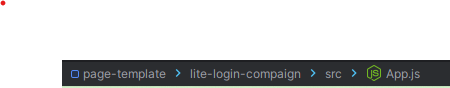

# 1.快捷键

| 说明               | Mac | Windows      |
| ------------------ | --- | ------------ |
| 打开最近打开的文件 |     | `Alt + R`    |
| 修改变量名         |     | `Shift + F6` |

## 自动导入

自动导入模块，自动删除没有用到的模块。

🌶️ 配置

打开 `Settings -> Editor -> General -> Auto Import`， 选中 Optimize imports on the fly 和 Add unambiguous imports on the fly

🌶️ 定义快捷键

Windows: `Ctrl + Alt + O`

## 跳转到 Navigation bar

所谓的 navigation Bar 就是当前的打开页面的面包屑导航。

对于 Windows 用户使用快捷键 `Alt + Home` 即可跳转到导航条。并选择当前导航条下的文件或方法分类

## 3. 当前文件编辑

当前文件编辑 指的是仅仅针对当前正在编辑的文件窗口对应的快捷键

|                                                   说明                                                    | MacOS 快捷键 | Windows 快捷键 |
| :-------------------------------------------------------------------------------------------------------: | :----------: | :------------: |
| **选中当前整个 Field.** 即指针定位到将要选中文字的任意位置，然后使用快捷键快速选中整个字段，并进行修改删除操作 |  `Ctr + G`   |                |

# 2. 美化

## 1. 隐藏行号

对于显示代码每行的行号在绝大多数的情况下是没有实际用途的，而且还会挤占代码空间，使整个编辑器不那么简洁。如果要隐藏它也是很简单的。

Settings -> Editor -> Appearance -> Show line numbers 取消勾选

### 2. 浮动目录

使用浮动目录的灵感来自于 NeoVim。使用浮动目录窗口的好处是当查看目录目录结构时，代码编辑区域窗口的大小不用改变，从而不会分散人的注意力；同时将目录窗口移到中间，不用在大屏移动脖子。
具体设置方法如下：

打开目录窗口（快捷键：Command + 1）-> 选中该窗口右上角三个点 -> 点击 <code>View Mode</code> 选择 <code>Window</code>

_注意： 这里还有一个选项：`Float`，区别是：当选择 Window 时，如果用户进入目录，选择文件并按 Enter 后目录窗口会自动关闭；如果选择 Float，则目录窗口会一直打开。_
