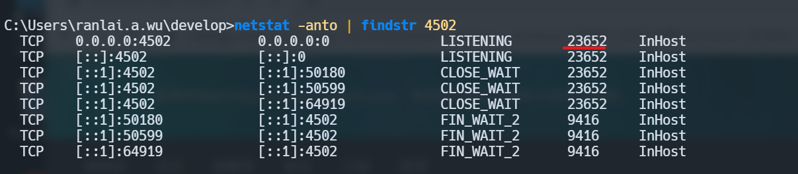

# 1. 聚焦搜索

在Mac上有Alfred和Laycast 等工具帮助用户进行聚焦搜索， 而在WIndows平台上也有类似工具

- [Keypirinha](https://keypirinha.com/)
- [Wox](http://www.wox.one/)

# 2. 常用操作

## 1. 查询端口进程

```shell
netstat -anto | findstr 端口
```



## 2. 查询端口占用的应用

```shell
tasklist | findstr 进程号
```

## 3. 杀死端口进程

```shell 
taskkill -PID 进程号 -F
```


# Bash 脚本编程

- [WIndows bat 批处理基础命令教程](https://cloud.tencent.com/developer/article/2118950)
- [Bat批处理教程](https://www.w3cschool.cn/dosmlxxsc1/wvqyr9.html)