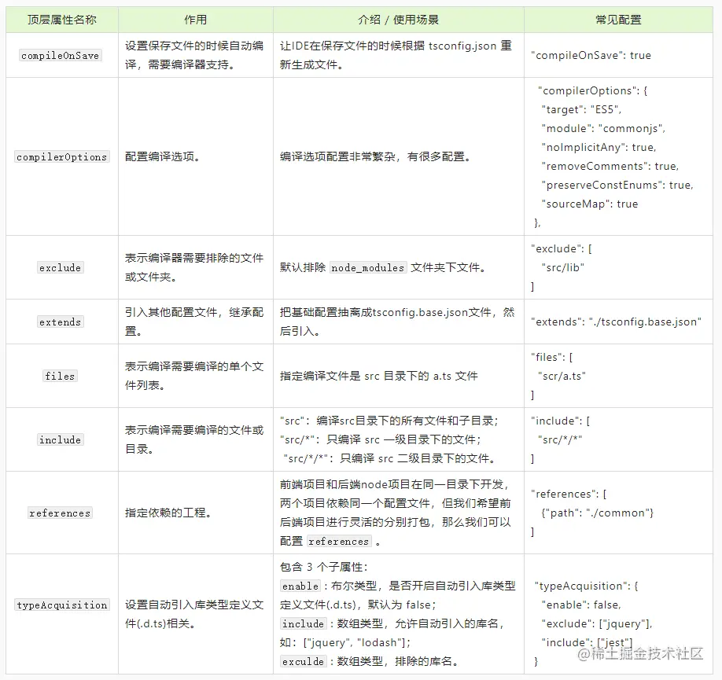

# Tsconfig.json

tsconfig.json 是TypeScript的配置文件。由于无法直接在浏览器或Node中运行TypeScript，需要先编译成JavaScript才可以执行程序。而在编译过程中有很多可配置参数，所以将这些参数放到一个配置文件中可以方便集中管理。

当在任意一个目录下使用`tsc`或其他编译器编译TypeScript文件时，编译器会从当前目录开始并逐级向上搜寻tsconfig.json文件，如果找到该文件则把tsconfig.json所在目录作为项目的跟目录。

如果通过指定配置文件的方式执行`tsc`命令，则使用指定配置文件从忽略路径下的tsconfig.json 文件。

通常tsconfig.json 包含两部分内容：**指定待编译文件** 和 **定义编译选项**。具体有以下几个顶层属性：

- `compileOnSave`
- `compilerOptions`
- `exclude`
- `extends`
- `files`
- `include`
- `references`
- `typeAcquisition`



## 一、配置说明

### 1. compileOnSave

`compileOnSave` 属性作用是**设置保存文件的时候自动编译，但需要编译器支持**。

```json
{
	// ...
  "compileOnSave": false,
}
```


### 2. compilerOptions

`compilerOptions` 属性作用是**配置编译选项**。若 `compilerOptions` 属性被忽略，则编译器会使用默认值，可以查看[《官方完整的编译选项列表》](https://link.juejin.cn/?target=https%3A%2F%2Fwww.typescriptlang.org%2Fdocs%2Fhandbook%2Fcompiler-options.html)。

编译选项配置非常繁杂，有很多配置，这里只列出常用的配置。

```json
{
  // ...
  "compilerOptions": {
    "incremental": true, // TS编译器在第一次编译之后会生成一个存储编译信息的文件，第二次编译会在第一次的基础上进行增量编译，可以提高编译的速度
    "tsBuildInfoFile": "./buildFile", // 增量编译文件的存储位置
    "diagnostics": true, // 打印诊断信息 
    "target": "ES5", // 生成代码的语言版本：将我们写的 TS 代码编译成哪个版本的 JS 代码
    "module": "CommonJS", // 生成代码的模板标准
    "outFile": "./app.js", // 将多个相互依赖的文件生成一个文件，可以用在AMD模块中，即开启时应设置"module": "AMD",
    "lib": ["DOM", "ES2015", "ScriptHost", "ES2019.Array"], // TS需要引用的库，即声明文件，es5 默认引用dom、es5、scripthost,如需要使用es的高级版本特性，通常都需要配置，如es8的数组新特性需要引入"ES2019.Array",
    "allowJS": true, // 允许编译器编译JS，JSX文件
    "checkJs": true, // 允许在JS文件中报错，通常与allowJS一起使用
    "outDir": "./dist", // 指定输出目录
    "rootDir": "./", // 指定输出文件目录(用于输出)，用于控制输出目录结构
    "declaration": true, // 生成声明文件，开启后会自动生成声明文件
    "declarationDir": "./file", // 指定生成声明文件存放目录
    "emitDeclarationOnly": true, // 只生成声明文件，而不会生成js文件
    "sourceMap": true, // 生成目标文件的sourceMap文件
    "inlineSourceMap": true, // 生成目标文件的inline SourceMap，inline SourceMap会包含在生成的js文件中
    "declarationMap": true, // 为声明文件生成sourceMap
    "typeRoots": [], // 声明文件目录，默认时node_modules/@types
    "types": [], // 加载的声明文件包
    "removeComments":true, // 删除注释 
    "noEmit": true, // 不输出文件,即编译后不会生成任何js文件
    "noEmitOnError": true, // 发送错误时不输出任何文件
    "noEmitHelpers": true, // 不生成helper函数，减小体积，需要额外安装，常配合importHelpers一起使用
    "importHelpers": true, // 通过tslib引入helper函数，文件必须是模块
    "downlevelIteration": true, // 降级遍历器实现，如果目标源是es3/5，那么遍历器会有降级的实现
    "strict": true, // 开启所有严格的类型检查
    "alwaysStrict": true, // 在代码中注入'use strict'
    "noImplicitAny": true, // 不允许隐式的any类型
    "strictNullChecks": true, // 不允许把null、undefined赋值给其他类型的变量
    "strictFunctionTypes": true, // 不允许函数参数双向协变
    "strictPropertyInitialization": true, // 类的实例属性必须初始化
    "strictBindCallApply": true, // 严格的bind/call/apply检查
    "noImplicitThis": true, // 不允许this有隐式的any类型
    "noUnusedLocals": true, // 检查只声明、未使用的局部变量(只提示不报错)
    "noUnusedParameters": true, // 检查未使用的函数参数(只提示不报错)
    "noFallthroughCasesInSwitch": true, // 防止switch语句贯穿(即如果没有break语句后面不会执行)
    "noImplicitReturns": true, //每个分支都会有返回值
    "esModuleInterop": true, // 允许export=导出，由import from 导入
    "allowUmdGlobalAccess": true, // 允许在模块中全局变量的方式访问umd模块
    "moduleResolution": "node", // 模块解析策略，ts默认用node的解析策略，即相对的方式导入
    "baseUrl": "./", // 解析非相对模块的基地址，默认是当前目录
    "paths": { // 路径映射，相对于baseUrl
      // 如使用jq时不想使用默认版本，而需要手动指定版本，可进行如下配置
      "jquery": ["node_modules/jquery/dist/jquery.min.js"]
    },
    "rootDirs": ["src","out"], // 将多个目录放在一个虚拟目录下，用于运行时，即编译后引入文件的位置可能发生变化，这也设置可以虚拟src和out在同一个目录下，不用再去改变路径也不会报错
    "listEmittedFiles": true, // 打印输出文件
    "listFiles": true// 打印编译的文件(包括引用的声明文件)
  }
}
```

每一个配置选项及其类型、默认值等的详细描述如下：

| 选项                           | 类型     | 默认值                                                     | 描述                                                         |
| ------------------------------ | -------- | ---------------------------------------------------------- | ------------------------------------------------------------ |
| `target`                       | string   | "ES3"                                                      | 指定ECMAScript目标版本 `"ES3"`（默认）， `"ES5"`， `"ES6"`/ `"ES2015"`， `"ES2016"`， `"ES2017"`或 `"ESNext"` |
| `module`                       | string   | target === "ES6" ? "ES6" : "commonjs"                      | 指定生成哪个模块系统代码： `"None"`， `"CommonJS"`， `"AMD"`， `"System"`， `"UMD"`， `"ES6"`或 `"ES2015"`。 只有 `"AMD"`和 `"System"`能和 `--outFile`一起使用。`"ES6"`和 `"ES2015"`可使用在目标输出为 `"ES5"`或更低的情况下 |
| `moduleResolution`             | string   | module === "AMD" or "System" or "ES6" ? "Classic" : "Node" | 决定如何处理模块。或者是`"Node"`对于Node.js/io.js，或者是`"Classic"`（默认）。查看模块解析了解详情 |
| `removeComments`               | boolean  | false                                                      | 删除所有注释，除了以 `/!*`开头的版权信息                     |
| `useDefineForClassFields`      | boolean  | false                                                      | 使用 Object.defineProperty 定义 class 中的属性，而非使用 obj.key = value 的形式定义属性 |
| `strict`                       | boolean  | false                                                      | 启用所有严格类型检查选项。启用 `--strict`相当于启用 `--noImplicitAny`, `--noImplicitThis`, `--alwaysStrict`， `--strictNullChecks`和 `--strictFunctionTypes`和`--strictPropertyInitialization` |
| `noImplicitAny`                | boolean  | false                                                      | 在表达式和声明上有隐含的 `any`类型时报错                     |
| `noImplicitThis`               | boolean  | false                                                      | 当 `this`表达式的值为 `any`类型的时候，生成一个错误          |
| `alwaysStrict`                 | boolean  | false                                                      | 以严格模式解析并为每个源文件生成 `"use strict"`语句          |
| `strictNullChecks`             | boolean  | false                                                      | 在严格的 `null`检查模式下， `null`和 `undefined`值不包含在任何类型里，只允许用它们自己和 `any`来赋值（有个例外， `undefined`可以赋值到 `void`） |
| `strictFunctionTypes`          | boolean  | false                                                      | 禁用函数参数双向协变检查                                     |
| `strictPropertyInitialization` | boolean  | false                                                      | 确保类的非`undefined`属性已经在构造函数里初始化。若要令此选项生效，需要同时启用`--strictNullChecks`。jsxstring"Preserve"在 `.tsx`文件里支持JSX： `"React"`或 `"Preserve"`。查看 JSX。jsxFactorystring"React.createElement"指定生成目标为react JSX时，使用的JSX工厂函数，比如 `React.createElement`或 `h` |
| `sourceMap`                    | boolean  | false                                                      | 生成相应的 `.map`文件                                        |
| `resolveJsonModule`            | boolean  | false                                                      | 允许引入 JSON 文件                                           |
| `isolatedModules`              | boolean  | false                                                      | 该属性要求所有文件都是 ES Module 模块                        |
| `esModuleInterop`              | boolean  | false                                                      | 允许使用 import 引入使用 export = 导出的内容                 |
| `skipLibCheck`                 | boolean  | false                                                      | 跳过对 .d.ts 文件的类型检查                                  |
| `lib`                          | string[] |                                                            | 引入 ES 最新特性和 DOM 接口的类型定义                        |
| `composite`                    | boolean  | false                                                      | 对于引用项目必须设置该属性                                   |
| `allowSyntheticDefaultImports` | boolean  | false                                                      | 允许使用 import 导入使用 export = 导出的默认内容             |
| `declaration`                  | boolean  | false                                                      | 生成相应的 `.d.ts`文件                                       |
| `declarationDir`               | string   |                                                            | 生成声明文件的输出路径                                       |
| `rootDirs`                     | string[] |                                                            | 将多个目录放在一个虚拟目录下，用于运行时，即编译后引入文件的位置可能发生变化，这也设置可以虚拟src和out在同一个目录下，不用再去改变路径也不会报错 |


### 3. exclude

`exclude` 属性作用是**指定编译器需要排除的文件或文件夹**。默认排除 `node_modules` 文件夹下文件。

```json
{
	// ...
  "exclude": [
    "src/lib" // 排除src目录下的lib文件夹下的文件不会编译
  ]
}
```

和 `include` 属性一样，支持 glob 通配符：

- `*` 匹配0或多个字符（不包括目录分隔符）
- `?` 匹配一个任意字符（不包括目录分隔符）
- `**/` 递归匹配任意子目录

### 4.extends

`extends` 属性作用是**引入其他配置文件，继承配置**。默认包含当前目录和子目录下所有 TypeScript 文件。

```json
{
	// ...
  // 把基础配置抽离成tsconfig.base.json文件，然后引入
	"extends": "./tsconfig.base.json"
}
```

### 5.files

`files` 属性作用是**指定需要编译的单个文件列表**。默认包含当前目录和子目录下所有 TypeScript 文件。

```json
{
	// ...
  "files": [
    // 指定编译文件是src目录下的leo.ts文件
    "scr/leo.ts"
  ]
}
```

### 6. include

`include` 属性作用是**指定编译需要编译的文件或目录**。

```json
{
	// ...
  "include": [
    // "scr" // 会编译src目录下的所有文件，包括子目录
    // "scr/*" // 只会编译scr一级目录下的文件
    "scr/*/*" // 只会编译scr二级目录下的文件
  ]
}
```

### 7. references

`references` 属性作用是**指定工程引用依赖。** 在项目开发中，有时候我们为了方便将前端项目和后端`node`项目放在同一个目录下开发，两个项目依赖同一个配置文件和通用文件，但我们希望前后端项目进行灵活的分别打包，那么我们可以进行如下配置：

```json
{
	// ...
  "references": [ // 指定依赖的工程
     {"path": "./common"}
  ]
}
```

### 8. typeAcquisition

`typeAcquisition` 属性作用是**设置自动引入库类型定义文件(.d.ts)相关。** 包含 3 个子属性：

- `enable` : 布尔类型，是否开启自动引入库类型定义文件(.d.ts)，默认为 false；
- `include` : 数组类型，允许自动引入的库名，如：["jquery", "lodash"]；
- `exculde` : 数组类型，排除的库名。

```json
{
	// ...
  "typeAcquisition": {
    "enable": false,
    "exclude": ["jquery"],
    "include": ["jest"]
  }
}
```

## 二、使用示例

### 1. 编译JSX代码

1. 创建测试项目 webpack-demo，结构如下：

```bash
webpack-demo/
  |- package.json
  |- tsconfig.json
  |- webpack.config.js
  |- /dist
    |- bundle.js
    |- index.html
  |- /src
    |- index.js
    |- index.ts
  |- /node_modules
```

2. 安装 TypeScript 和 ts-loader：

```bash
$ npm install --save-dev typescript ts-loader
```

3. 配置tsconfig.json，支持JSX，并将TypeScript编译为ES5 

```diff
{
  "compilerOptions": {
    "outDir": "./dist/",
    "noImplicitAny": true,
+   "module": "es6",
+   "target": "es5",
+   "jsx": "react",
    "allowJs": true
  }
}
```

4. 配置 webpack.config.js，使其能够处理 TypeScript 代码，这里主要在 `rules` 中添加 `ts-loader` ：

```javascript
const path = require('path');

module.exports = {
  entry: './src/index.ts',
  module: {
    rules: [
      {
        test: /\.tsx?$/,
        use: 'ts-loader',
        exclude: /node_modules/
      }
    ]
  },
  resolve: {
    extensions: [ '.tsx', '.ts', '.js' ]
  },
  output: {
    filename: 'bundle.js',
    path: path.resolve(__dirname, 'dist')
  }
};
```

### 2. 配置source map

想要启用 source map，我们必须配置 TypeScript，以将内联的 source map 输出到编译后的 JavaScript 文件中。

只需要在 tsconfig.json 中配置 sourceMap 属性：

```diff
  {
    "compilerOptions": {
      "outDir": "./dist/",
+     "sourceMap": true,
      "noImplicitAny": true,
      "module": "commonjs",
      "target": "es5",
      "jsx": "react",
      "allowJs": true
    }
  }
```

然后配置 webpack.config.js 文件，让 webpack 提取 source map，并内联到最终的 bundle 中：

```diff
  const path = require('path');

  module.exports = {
    entry: './src/index.ts',
+   devtool: 'inline-source-map',
    module: {
      rules: [
        {
          test: /\.tsx?$/,
          use: 'ts-loader',
          exclude: /node_modules/
        }
      ]
    },
    resolve: {
      extensions: [ '.tsx', '.ts', '.js' ]
    },
    output: {
      filename: 'bundle.js',
      path: path.resolve(__dirname, 'dist')
    }
  };
```

### 3. Chakra UI

下面是Chakra UI的 TypeScript配置文件

```json
{
  "compilerOptions": {
    "target": "esnext",
    "module": "esnext",
    "lib": ["dom", "esnext"],
    "declaration": true,
    "sourceMap": true,
    "moduleResolution": "node",
    "skipLibCheck": true,
    "strict": true,
    "isolatedModules": true,
    "noFallthroughCasesInSwitch": true,
    "jsx": "react-jsx",
    "esModuleInterop": true,
    "resolveJsonModule": true,
    "allowSyntheticDefaultImports": true,
    "downlevelIteration": true
  },
  "include": [
    "@types",
    "packages",
    "scripts",
    "tooling",
    "plopfile.ts",
  ],
  "exclude": ["**/node_modules", "**/template*"]
}
```

